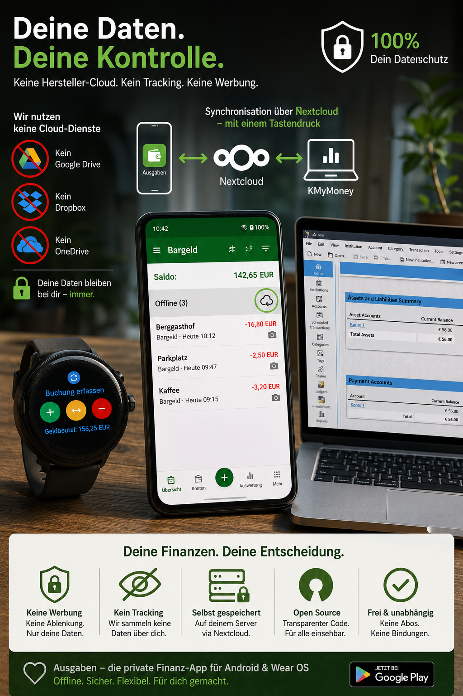
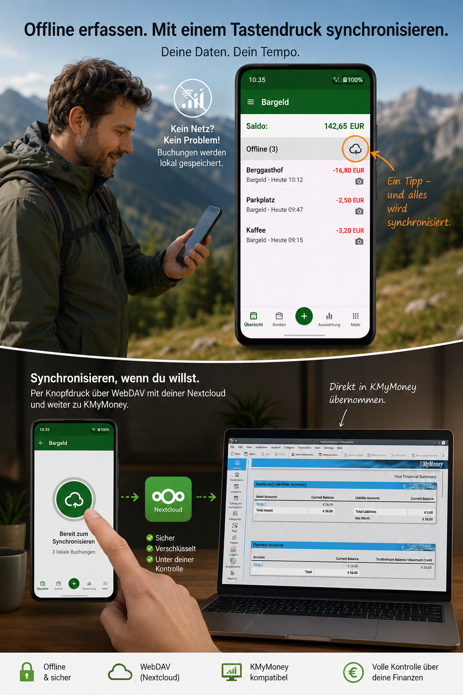
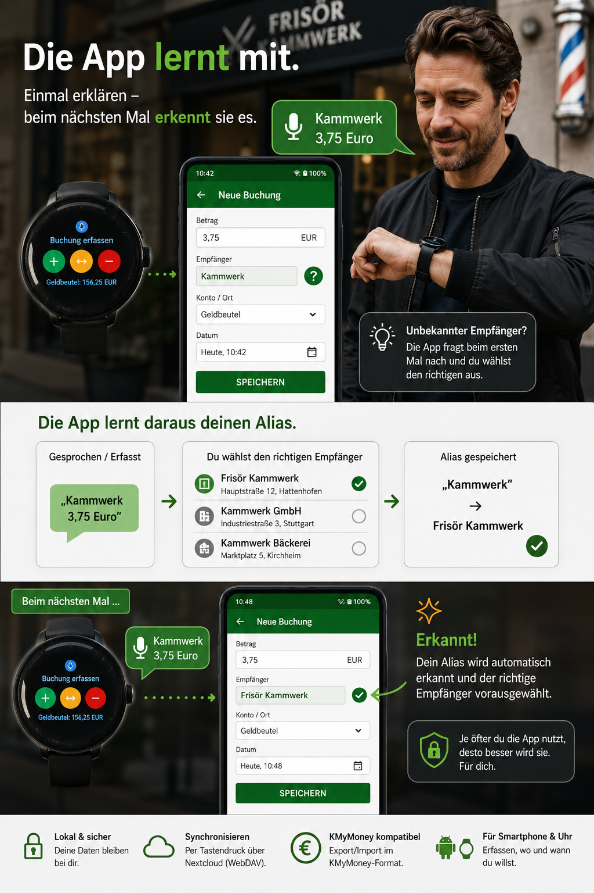
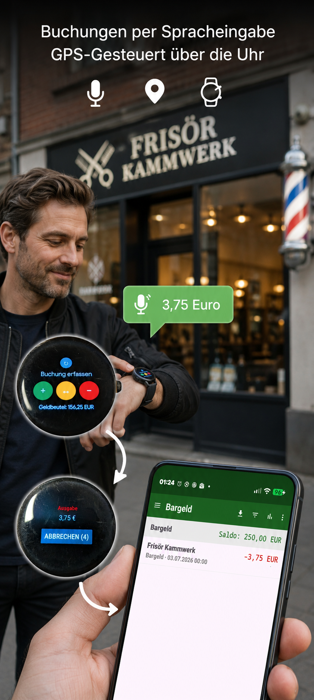
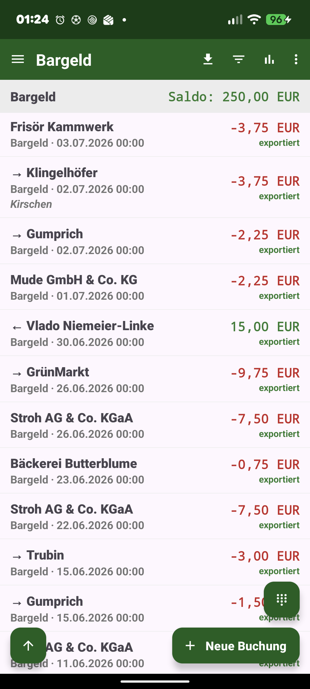
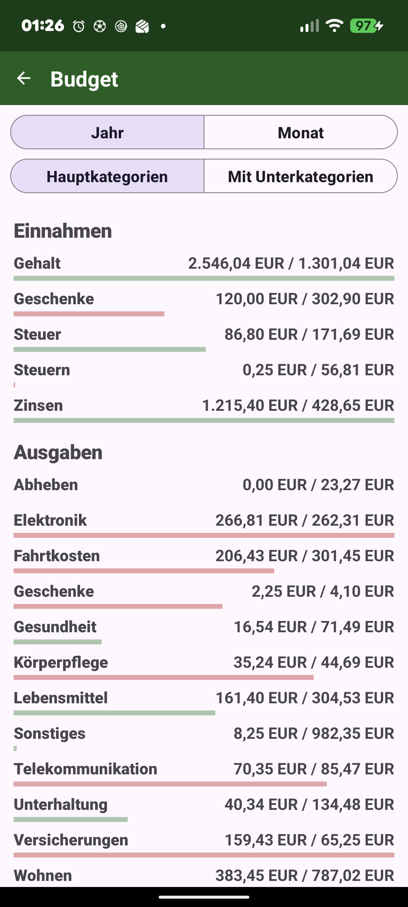
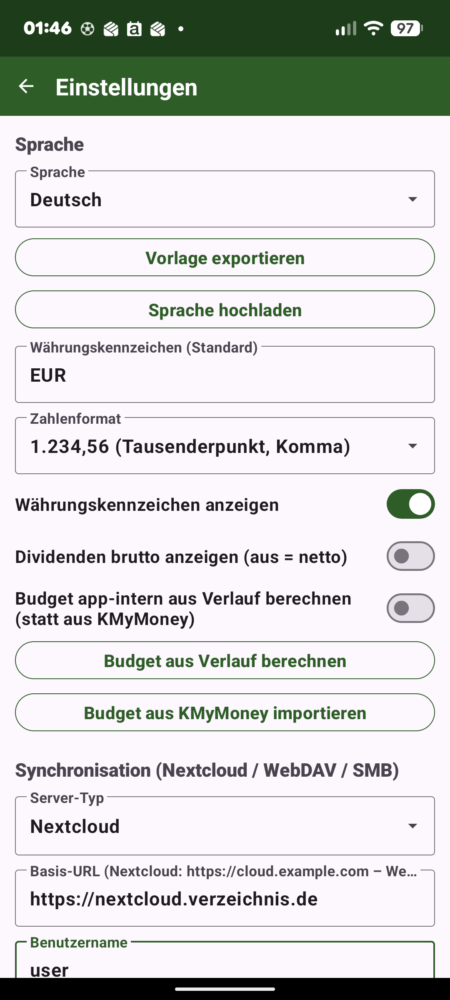

# Ausgaben

[English](README.md) · **Deutsch**

Eine mobile Ergänzung zu **[KMyMoney](https://kmymoney.org/)** (Android, Java). Erfasse Bargeld-Ausgaben,
-Einnahmen und Umbuchungen unterwegs direkt auf dem Smartphone oder einer Wear-OS-Uhr – und exportiere sie
nach KMyMoney, statt alles später von Hand nachzutragen.

> Offline-first · kein Konto, keine Werbung, kein Tracking · Open Source.

📖 Das vollständige **[Benutzerhandbuch (PDF, Deutsch)](docs/Handbuch-Ausgaben-de.pdf)** beschreibt jede
Funktion im Detail, mit Bildschirmfotos.

<p>
  
  
  
  
</p>

## Warum die App für KMyMoney-Nutzer interessant ist

- 📲 **Mobile Erweiterung für KMyMoney** – Bargeldausgaben unterwegs sofort erfassen
- 🔌 **Nahtlose KMyMoney-Integration** über `.kmy`-Dateien oder CSV-Import
- 🗂️ **Sync über einen gemeinsamen WebDAV- oder SMB-Ordner** – eigener Server, eigene Daten
- 🔒 **Vollständig offline nutzbar** – keine zusätzliche Cloud, kein Herstellerkonto
- ⌚ **Wear-OS-App mit Spracheingabe** – Ausgabe direkt vom Handgelenk sprechen
- ➗ **Splitbuchungen und Umbuchungen**, Kategorien, Orte/Bestände und Depot-Import
- 📈 **Auswertungen**: Verlauf je Konto, Kategorien-Kreisdiagramm, Budget (Ist/Soll), Depot-Rendite
- 🌍 **Mehrsprachig** – Deutsch und Englisch eingebaut, weitere Sprachen per Übersetzungs-Upload
- 👆 **Biometrische Sperre**, verschlüsselte Zugangsdaten, Backup & Wiederherstellung
- 🆓 **Keine Werbung. Open Source.**

## Screenshots

<p>
  
  
  
  
  
  
  
  
</p>

## Download

Die aktuellen APKs findest du auf der **[Releases-Seite](../../releases/latest)**:

- **app-full-release.apk** – die Handy-App mit Wear-OS-Anbindung (Android 8 / API 26 und neuer)
- **app-foss-release.apk** – dieselbe Handy-App ohne Google Play Services (F-Droid-Variante)
- **wear-release.apk** – die Wear-OS-Uhren-App (gesprochene Ausgaben an die Handy-App). Nur nötig,
  wenn die Uhr die App nicht automatisch mit der Handy-Installation erhält; sonst separat auf die Uhr
  sideloaden.

Beide sind mit demselben Schlüssel signiert (Voraussetzung für die Wear-Data-Layer-Kopplung). Zum
Installieren „Unbekannte Quellen zulassen".

### Build-Flavors / F-Droid

Die Handy-App baut in zwei Varianten:

- **`full`** – mit der Wear-OS-Anbindung über Google Play Services (`./gradlew :app:assembleFullRelease`).
- **`foss`** – dieselbe App **ohne jegliches Google Play Services**
  (`./gradlew :app:assembleFossRelease`), gedacht für **F-Droid**. Alle Funktionen bleiben, nur die
  Wear-OS-Brücke fehlt.

Die Wear-OS-App (`:wear`) benötigt den Google Wear Data Layer und bleibt daher **GitHub-only**. Hinweise
zur F-Droid-Paketierung in [`fdroid/`](fdroid/).

## Funktionen im Überblick

Details, Screenshots und die genaue Bedienung stehen im **[Benutzerhandbuch](docs/Handbuch-Ausgaben-de.pdf)**.

- **Buchungen erfassen**: Ausgabe/Umbuchung/Einnahme, Splitbuchungen, Belegfoto, Spracheingabe
  („Frisör 20 €“), stille Betrag-only-Erfassung per GPS-Standort, lernende Alias-Namen für
  Zahlungsempfänger.
- **Liste & Filter**: Suche über Empfänger/Notiz/Kategorie, Betrags- und Zeitraumfilter, Rückgängig nach
  Löschen, eigene Rechentastatur im Betragsfeld.
- **Auswertungen**: Verlaufsdiagramm je Konto/Ort/gesamt, Kategorien-Kreisdiagramm („Wofür geht mein
  Geld?“), Budget (Ist/Soll aus KMyMoney oder app-intern berechnet), geplante Buchungen als Vorschau.
- **Bestände & Depot**: mehrere Bargeld-**Orte** je Konto mit eigenem Bewegungsjournal und Kassensturz;
  Depot-Import mit Kursen, Käufen/Verkäufen/Dividenden, Gewinn/Verlust-Auswertung.
- **Synchronisierung**: Nextcloud/WebDAV/SMB, `.kmy`-Modus (direktes Schreiben/Lesen der KMyMoney-Datei
  inkl. Splits, Umbuchungen und Depot) oder CSV-Export; automatische Sicherung vor jedem Export, Schutz vor
  gleichzeitigem Überschreiben.
- **Mehrsprachig**: Deutsch/Englisch eingebaut, weitere Sprachen per Übersetzungsdatei nachrüstbar (auch
  für die Uhr).
- **Sicherheit**: optionale biometrische App-Sperre, GPS standardmäßig aus, verschlüsselte Zugangsdaten.

## Wear OS (Sprach-Schnellerfassung)

Ein zusätzliches Modul `:wear` erfasst eine Bargeldausgabe per Sprache direkt auf einer Wear-OS-Uhr
(„Frisör 20 Euro“). Die Uhr nimmt nur den Text auf; Verarbeitung und Buchungsanlage passieren auf dem
Smartphone (derselbe Parser). Die Erkennung folgt der gewählten App-Sprache und **bevorzugt Offline**-
Spracherkennung, sodass die Aufnahme auch bei ausgeschaltetem Handy klappt; ist offline keine Sprache
verfügbar, fällt die Uhr auf den stillen Zahlenblock zurück. Offline aufgenommene Buchungen werden
zwischengespeichert (inkl. GPS) und automatisch nachgereicht, sobald das Handy erreichbar ist – ohne
Verlust und ohne Dopplung. Ein optionaler Handy-Schalter („Offline-Sprachpaket auf der Uhr installieren“,
nur `full`-Build) lädt das Offline-Sprachmodell der gewählten Sprache auf die Uhr. Details im Handbuch,
Kapitel „Wear OS“.

Voraussetzung: Phone- und Wear-App haben dieselbe `applicationId` **und** dieselbe Signatur.

## CSV-Format (Export)

Deutsch: Spaltentrenner `;`, Dezimaltrennzeichen `,`, Datum `TT.MM.JJJJ`, UTF-8, CRLF. Splitbuchungen
werden je Kategorie als eigene Zeile geschrieben.

```
Datum;Empfänger;Konto;Typ;Betrag;Notiz;Kategorie
29.06.2026;Metzgerei;Bargeld;Ausgabe;-7,30;Mittagessen;Lebensmittel
```

## Technik

- Java, Gradle 8.9 / AGP 8.7.3, `minSdk 26` (`:app`) bzw. `minSdk 30` (`:wear`), `compileSdk 34`.
- Module: `:app` (Phone) und `:wear` (Wear OS).
- [Room](https://developer.android.com/training/data-storage/room) (SQLite), OkHttp (WebDAV),
  [smbj](https://github.com/hierynomus/smbj) (SMB), [MPAndroidChart](https://github.com/PhilJay/MPAndroidChart),
  [osmdroid](https://github.com/osmdroid/osmdroid) (Karten-Auswahl),
  [androidx.security](https://developer.android.com/jetpack/androidx/releases/security)
  (verschlüsselte Prefs), [androidx.biometric](https://developer.android.com/jetpack/androidx/releases/biometric),
  [play-services-wearable](https://developer.android.com/training/wearables/data/data-layer) (Data Layer)
  und [androidx.wear.tiles](https://developer.android.com/training/wearables/tiles) (Tile).

## Bauen

```bash
./gradlew assembleDebug
```

Das Android-SDK wird über `local.properties` (`sdk.dir=…`) gefunden – diese Datei ist nicht
eingecheckt und muss lokal vorhanden sein (legt Android Studio automatisch an). Für einen signierten
Release-Build wird `keystore.properties` benötigt (ebenfalls nicht eingecheckt); fehlt sie, entsteht
ein unsigniertes Release.

## Sync-Ziel einrichten (Nextcloud / WebDAV / SMB)

In den Einstellungen den **Server-Typ** wählen, dann Basis-URL/Freigabe, Benutzername und Passwort
eintragen; ein Button **„Verbindung testen"** prüft die Zugangsdaten. Ohne konfiguriertes Sync-Ziel wird
lokal in einen selbst gewählten Ordner exportiert.

- **Nextcloud**: Basis-URL des Servers + ein **App-Passwort** (Nextcloud → Sicherheit → App-Passwort).
- **WebDAV (generisch)**: vollständige DAV-Wurzel-URL, Auth per HTTP-Basic.
- **SMB/Samba**: `smb://Host/Freigabe`; leerer Benutzer = Gast, Domäne als `DOMÄNE\Benutzer`. SMB2/3.

## Lizenz

Veröffentlicht unter der **GNU General Public License v3.0** – siehe [LICENSE](LICENSE).

## Haftungsausschluss / Hinweis zum Entwicklungsprozess

Dieses Projekt wurde ursprünglich mit umfangreicher Unterstützung durch KI entwickelt.

Ich arbeite seit etwa 25 Jahren als Softwareentwickler, allerdings überwiegend in Technologien außerhalb des modernen Mobile-App-Umfelds. Obwohl ich Erfahrung mit Java habe und Teile des Quellcodes geprüft habe, kann ich nicht behaupten, jedes während der Entwicklung erzeugte Implementierungsdetail vollständig zu verstehen.

Die Anwendung wurde getestet und wird aktiv genutzt. Dennoch können Fehler, architektonische Schwächen oder Codebereiche vorhanden sein, die von Entwicklern mit mehr Android-spezifischer Erfahrung verbessert werden könnten.

Ich überprüfe den erzeugten Code kontinuierlich, erweitere mein Verständnis der Implementierung und entwickle das Projekt fortlaufend weiter. Code-Reviews, Fehlermeldungen, Verbesserungsvorschläge und Beiträge aus der Community sind daher ausdrücklich willkommen.
