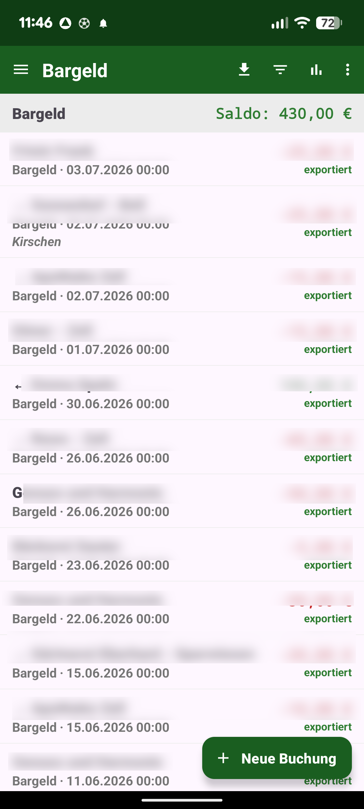
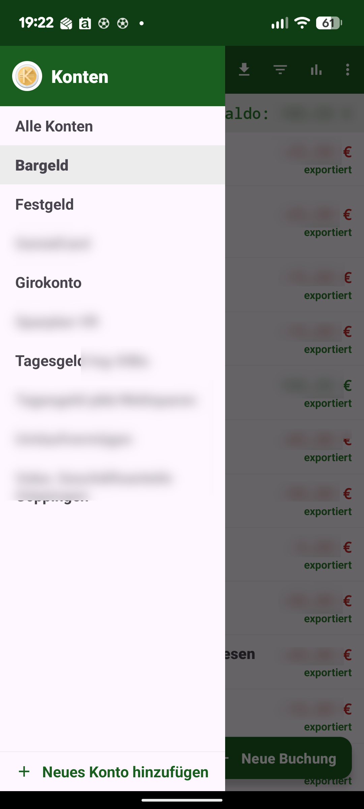
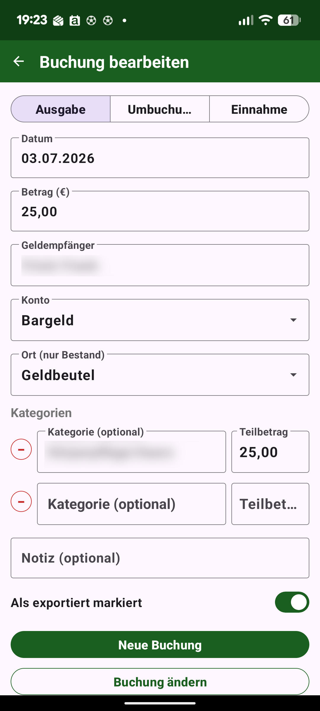
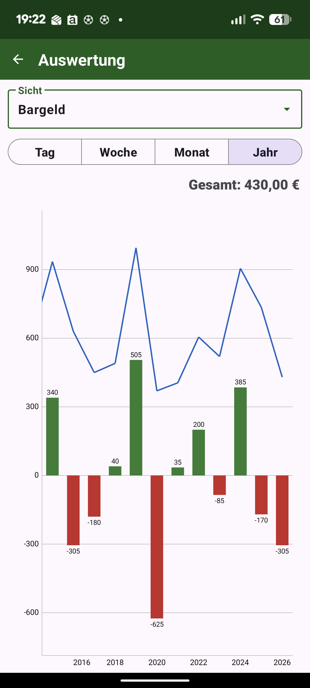
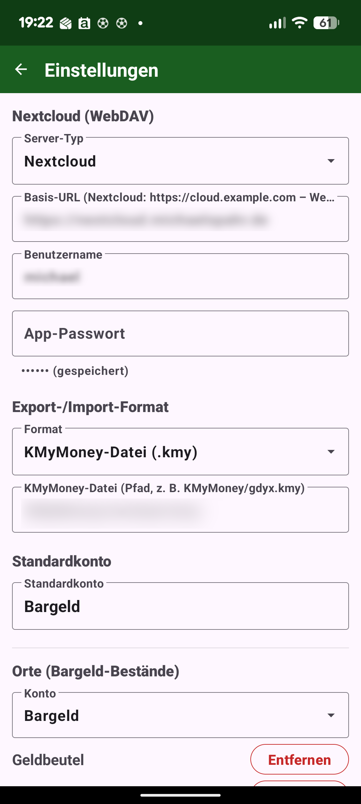
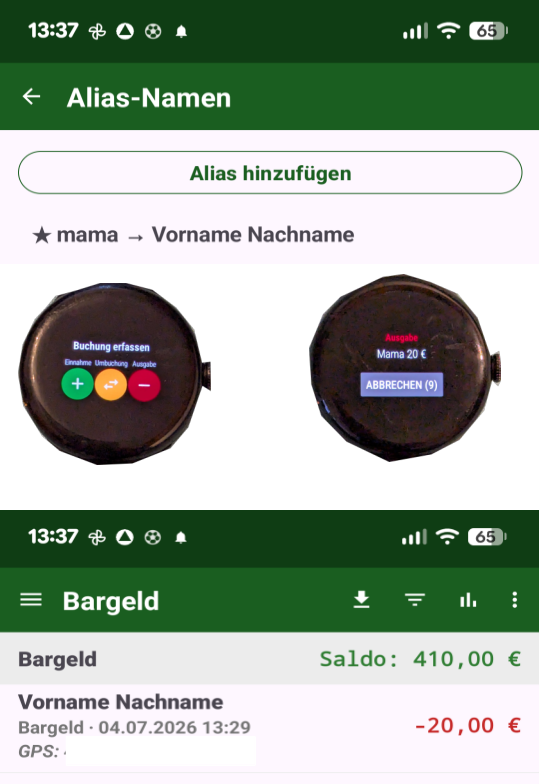

# Ausgaben

[English](README.md) · **Deutsch**

Eine mobile Ergänzung zu **[KMyMoney](https://kmymoney.org/)** (Android, Java). Erfasse Bargeld-Ausgaben,
-Einnahmen und Umbuchungen unterwegs direkt auf dem Smartphone oder einer Wear-OS-Uhr – und exportiere sie
nach KMyMoney, statt alles später von Hand nachzutragen.

> Offline-first · kein Konto, keine Werbung, kein Tracking · Open Source.

## Warum die App für KMyMoney-Nutzer interessant ist

- 📲 **Mobile Erweiterung für KMyMoney** – Bargeldausgaben unterwegs sofort erfassen
- 🔌 **Nahtlose KMyMoney-Integration** über `.kmy`-Dateien oder CSV-Import
- 🗂️ **Sync über einen gemeinsamen WebDAV- oder SMB-Ordner** – eigener Server, eigene Daten
- 🔒 **Vollständig offline nutzbar** – keine zusätzliche Cloud, kein Herstellerkonto
- ⌚ **Wear-OS-App mit Spracheingabe** – Ausgabe direkt vom Handgelenk sprechen
- ➗ **Splitbuchungen und Umbuchungen**, Kategorien, Orte und Salden je Konto
- 📈 **Diagramme und Auswertung** (Balken/Linie, je Konto, Ort oder gesamt), Depot-Import
- 🌍 **Mehrsprachig konzipiert** – **Deutsch und Englisch**, Währung je Konto, und **weitere Sprachen
  selbst nachrüstbar** per Übersetzungs-Upload (ohne Neu-Build)
- 👆 **Biometrische Sperre**, verschlüsselte Zugangsdaten, Backup & Wiederherstellung
- 🆓 **Keine Werbung. Open Source.**

## Screenshots

<p>
  
  
  
  
  
  
</p>

## Download

Die aktuellen APKs findest du auf der **[Releases-Seite](../../releases/latest)**:

- **Ausgaben-v1.0.apk** – die Handy-App (Android 8 / API 26 und neuer)
- **Ausgaben-Wear-v1.0.apk** – die Wear-OS-Uhren-App (gesprochene Ausgaben an die Handy-App). Nur nötig,
  wenn die Uhr die App nicht automatisch mit der Handy-Installation erhält; sonst separat auf die Uhr
  sideloaden.

Beide sind mit demselben Schlüssel signiert (Voraussetzung für die Wear-Data-Layer-Kopplung). Zum
Installieren „Unbekannte Quellen zulassen".

### Build-Flavors / F-Droid

Die Handy-App baut in zwei Varianten:

- **`full`** – mit der Wear-OS-Anbindung über Google Play Services (Wear Data Layer). Diese Variante nutzt
  das GitHub-Release (`./gradlew :app:assembleFullRelease`).
- **`foss`** – dieselbe App **ohne jegliches Google Play Services** (`./gradlew :app:assembleFossRelease`).
  Diese Variante ist für **F-Droid** gedacht. Sprachaufnahme am Handy, Sync und alle übrigen Funktionen
  bleiben; nur die Wear-OS-Brücke fehlt.

Die Wear-OS-App (`:wear`) benötigt den Google Wear Data Layer und bleibt daher **GitHub-only** (die
Mikrofon-Berechtigung ist davon unberührt). Hinweise zur F-Droid-Paketierung in [`fdroid/`](fdroid/).

## Funktionen

### Buchungen erfassen
- Typ-Umschalter **Ausgabe / Umbuchung / Einnahme**, Betrag, Geldempfänger, Konto (Auswahl aus
  vorhandenen Konten), Notiz und Datum (heute vorbelegt, „Heute"-Schnellwahl). Ist im Hauptbildschirm ein
  einzelnes Konto gewählt, wird die neue Buchung in diesem Konto angelegt.
- **Datum-Rückfrage** nur beim Kopieren: Öffnet man eine bestehende Buchung, lässt das Datum unverändert und
  legt daraus per „als neu speichern" eine Kopie an, fragt die App, ob das (alte) Datum oder heute gelten
  soll. Beim reinen Ändern der Buchung oder selbst gesetztem Datum kommt keine Rückfrage.
- **Splitbuchungen**: mehrere Kategorien mit Teilbeträgen. Bei einer Kategorie sind Gesamt- und
  Kategoriebetrag gekoppelt; bei mehreren muss die Summe dem Gesamtbetrag entsprechen. Teilbeträge
  dürfen negativ sein.
- **Umbuchung** (Kontotransfer): zwei Konten (Von/Nach) + optionaler Zahlungsempfänger; legt eine
  verknüpfte Buchung in beiden Konten an. Zusätzlich lassen sich **Von-Ort und Nach-Ort** wählen – dann
  wird das jeweilige **Ortsjournal** mitgeführt (Von-Konto −Betrag, Nach-Konto +Betrag); Bearbeiten/Löschen
  rollt die Ort-Bewegungen wieder zurück.
- **Ort** (nur bei in der App angelegten Ausgaben/Einnahmen): wählbar mit dem Standardort des Kontos
  vorbelegt; bestimmt, welchem Bargeld-Ort die Buchung ihre Ort-Bewegung gutschreibt (siehe „Orte/Bestände").
  Bei importierten Buchungen wird kein Ort-Feld gezeigt.
- **GPS-Koordinaten in der Notiz**: nur wenn der Standort-Schalter (Einstellungen → Sicherheit, siehe unten)
  **eingeschaltet** ist. Dann erscheinen bei einer *neuen* Buchung die aktuellen Koordinaten bereits während
  der Eingabe im Notizfeld als `GPS: lat, lon` (sichtbar und editierbar; der übrige Notiztext bleibt
  erhalten, während man tippt wird nicht überschrieben). Rein lokal – die Position wird nicht an einen
  externen Dienst gesendet. Ohne Berechtigung/Position bleibt das Feld leer; bestehende Buchungen werden
  nicht angefasst.
- **Sprach-Schnellerfassung**: langer Druck auf **„Neue Buchung"** öffnet die Spracheingabe. Sagt man
  z. B. „Frisör 20 €", wird eine passende Buchung als Vorlage geöffnet (Empfänger, Konto, Kategorie(n),
  Notiz, Buchungsart) – mit heutigem Datum und dem gesprochenen Betrag. Die Empfängersuche ist unscharf
  (findet „Frisör Frank" auch bei „Friseur"). Gibt es **mehrere gleichnamige Empfänger** (z. B. „REWE - Zell"
  und „REWE - Stuttgart"), wird bei bekanntem Standort der **nächstgelegene** als Vorlage gewählt.
- **Nur den Betrag erfassen (Standort-Auflösung)**: nur bei eingeschaltetem Standort-Schalter. Sagt man nur
  einen Betrag (oder tippt ihn über das **Ziffern-Symbol** unten still ein), sucht die App am aktuellen
  Standort (100 m) eine passende Vorlage – in den bestehenden Buchungen und im Alias-Verzeichnis
  (Reihenfolge: bevorzugte Aliase → Buchungen → übrige Aliase) – und übernimmt deren Daten. Im
  Ziffern-Dialog wird der so gefundene **Geldempfänger schon vor dem Speichern** unter dem Betrag angezeigt
  (aktualisiert sich mit dem Standort-Fix). Ein Alias kann **beliebig viele Standorte** führen (z. B. mehrere
  Filialen): im Alias fügt **„Koordinate hinzufügen"** eine Zeile mit Breite/Länge + **„Karte öffnen"**
  (OpenStreetMap) hinzu, der Minus-Knopf entfernt sie wieder; der Alias passt, wenn der aktuelle Standort
  **einer** dieser Koordinaten nahe ist. Aliase erhalten ihren Standort automatisch, wenn sie aus einer Buchung
  gelernt werden – erneutes Lernen an einem anderen Ort **ergänzt** die Koordinate (überschreibt sie nicht).
  Ohne Treffer
  wird nur der Betrag übernommen. Ist der Standort-Schalter **aus**, entfällt die Betrag-only-Erfassung am
  Handy (Ziffern-Symbol ausgeblendet); auf der Uhr bleibt sie möglich – die Buchung entsteht dann mit leerem
  Empfänger.
- **Alias-Namen (gelernte Zuordnungen)**: ändert man beim Speichern den per Sprache erkannten (oder beim
  Bearbeiten den bestehenden) Empfänger, fragt die App, ob sie sich die Zuordnung als Alias merken soll.
  Dabei wird der **Kontext der Buchung mitgespeichert** – Buchungsart, Konto, Kategorie(n) und **Ort** bzw.
  Von-/Bis-Konto und Von-/Nach-Ort bei Umbuchungen. Die Kategoriefelder und die Ort-Anzeige im
  Alias-Formular entsprechen dabei denen im Buchungseditor (gruppierte Kategorie-Baumauswahl; ein Ortsfeld
  erscheint nur bei einem Konto mit Orten). Die hinterlegte **Buchungsart** bestimmt am Phone den Typ der neuen
  Buchung (in der Wear-App gilt die per Knopf gewählte Art). Kommt derselbe gesprochene Begriff später erneut, wird der Alias gefunden (gleiche unscharfe
  Logik wie die Buchungssuche) und die neue Buchung mit richtigem Empfänger **und** den hinterlegten
  Konto-/Kategorie-Daten vorbelegt – auch für die Wear-Erfassung. So deckt ein Alias jede Buchungsart ab.
  Damit lässt sich die Tabelle auch bewusst als **Alias/Abkürzung** nutzen: „Mama 100 €" kann automatisch
  auf den realen Namen samt Konto/Kategorie gebucht werden.
- **Suchreihenfolge**: zuerst die als **„bevorzugt"** markierten Aliase, dann die bestehenden Buchungen,
  erst danach die übrigen Aliase. „Bevorzugt" ist eine Eigenschaft des einzelnen Alias (im Formular
  einstellbar, in der Liste mit ★ markiert).
- Einstellbar unter **Einstellungen → Alias-Namen**: die Nachfrage lässt sich abschalten (bestehende
  Aliase werden weiterhin angewandt, es kommen nur keine neuen Nachfragen hinzu), und über
  **„Alias-Namen verwalten"** lassen sich alle Aliase mit allen Feldern manuell anlegen, ändern und löschen.

### Übersicht & Auswertung
- Mehrere **Konten** über eine Navigationsschublade; Liste und Saldo je Konto oder „Alle Konten".
- Buchungsliste mit Farbkennzeichnung (negativ rot / positiv grün), „exportiert"-Markierung sowie
  Kennzeichnung von Split- (`Split`) und Umbuchungen (`→`/`←` Gegenkonto/Empfänger). **Kurzer Druck** öffnet
  eine Buchung als reine **Ansicht** (gleicher Aufbau wie der Editor, ohne Änderungsmöglichkeit), **langer
  Druck** zum Bearbeiten. In der Liste wird die Notiz auf zwei Zeilen gekürzt; im Editor umfasst das
  Notizfeld vier Zeilen.
- **Orte/Bestände** pro Konto (wo liegt das Bargeld physisch): jeder Ort führt ein eigenes
  Bewegungs-Journal; sein Saldo ist die Summe seiner Bewegungen. Eine in der App angelegte Buchung
  erzeugt automatisch eine Ort-Bewegung auf dem **Standardort** des Kontos (spätere Betrags-/Lösch-
  Änderungen hängen datierte Ausgleichs-Bewegungen an, die Historie bleibt erhalten). **„ohne Ort"** ist
  der berechnete Rest (Kontosaldo − Summe der Orte), sodass die Summe der Ort-Salden stets dem Kontosaldo
  entspricht. In den Beständen lassen sich Ort-Bewegungen einzeln anlegen/bearbeiten/löschen sowie zwischen
  Orten umbuchen (z. B. um eine importierte Buchung einem Ort zuzuordnen); ein Kassensturz setzt den Saldo
  eines Orts. Importierte Buchungen tragen keine Ort-Verknüpfung. Öffnet man eine solche alte Buchung
  **zum Bearbeiten**, wird das **Ort-Feld trotzdem angezeigt** (sofern das Konto Orte hat):
  **„Neue Buchung"** (duplizieren) speichert den gewählten Ort und legt die Bewegung an; **„Buchung ändern"**
  ignoriert den Ort, wenn die Buchung vorher keinen Ort hatte und bereits exportiert ist, und speichert ihn
  (mit Ausgleichs-Bewegung), wenn vorher ein Ort vorhanden war. In der reinen Ansicht bleibt das Feld
  ausgeblendet; bei **Umbuchungen** gibt es Von-/Nach-Ort mit Bewegung auf beiden Konten.
- **Filter** mit **Suchfeld über Empfänger, Notiz und Kategorie** (Teilstring, Groß-/Kleinschreibung egal –
  eine Buchung lässt sich damit auch über ihre Notiz finden), dazu Kategorie (als Baum), Betrag
  (Schieberegler) und **Datum von–bis** (Schieberegler in Monatsschritten; für ein taggenaues Datum tippt man
  es direkt ins Feld). Der Filter wirkt auf Liste **und** Auswertung (gemeinsame Suchlogik, damit beide nicht
  auseinanderlaufen). Bei Kategorie-Filter zeigt eine Splitbuchung nur den Teilbetrag der gewählten Kategorie.
- **Rechnen im Betragsfeld über die eigene Tastatur**: Das Betragsfeld öffnet eine **app-eigene
  Rechentastatur** (Ziffern, `⌫`, Dezimaltaste, `*`, `+`, `OK`) statt der System-Tastatur. `10+20*3` → 70,
  `100,50*2+25` → 226; erlaubt sind nur **Addition (`+`) und Multiplikation (`*`)** mit üblicher Priorität
  (Punkt vor Strich) sowie ein Dezimaltrennzeichen je Zahl. Subtraktion, Division, Klammern und Funktionen
  sind **nicht** möglich; ungültige Zeichen lassen sich gar nicht erst eintippen. `⌫` löscht das letzte
  Zeichen (langer Druck leert das Feld), **`OK`** wertet die Rechnung aus und ersetzt sie durch das Ergebnis;
  eine ungültige Rechnung wird mit einer Meldung quittiert. Gilt auch für die Teilbeträge einer Splitbuchung
  und die Wert-Direkteingabe im Hauptmenü.
- **Rückgängig nach dem Löschen**: Snackbar „Rückgängig" legt die Buchung wieder an (neue interne Nummer; im
  Ort-Journal bleiben Löschung und Wiederanlage als Historie stehen). Bei Umbuchungen nicht angeboten.
- **Launcher-Shortcut**: Langdruck auf das App-Symbol → **„Neue Buchung"**.
- **Auswertung** (Tag/Woche/Monat/Jahr) als Balken- + Linien-Diagramm mit Konto-, Orts- und
  Gesamt-Sichten; per Fingergeste zoombar (horizontal = Balkenanzahl, vertikal = Y-Achse).
- **Budget** (eigene Menüseite) stellt je Kategorie das **Ist** dem **Soll** gegenüber. Das Soll wird aus
  einer **KMyMoney-Budgetplanung** importiert (Knopf in den Einstellungen; nicht editierbar) oder
  **app-intern** aus dem Verlauf berechnet (Summe aller Vorjahre ÷ Anzahl der Jahre mit Daten). Ob eine
  Kategorie **Einnahme oder Ausgabe** ist, wird zuverlässig **aus der `.kmy`-Datei** bestimmt (KMyMoney-Typ),
  nicht mehr aus dem Vorzeichen der Buchungen: eine Erstattung mindert die Ausgabekategorie, kippt sie aber
  nicht; ein negativer Ist wird auf 0 gesetzt.
- **Monatsgenaue Budgets**: KMyMoney-Budgets werden monatsgenau importiert (`monatlich`/`monatweise`). Die
  **Jahressicht** summiert die Monate, die **Monatssicht** zeigt das Soll des angezeigten Monats gegen die
  Ist-Werte desselben Monats. In der Monatssicht blättert man per **Wischgeste** (oder Tippen auf den grauen
  Vor-/Folgemonat in der Kopfzeile) durch die Monate. Umschaltbar außerdem **nur Haupt- / mit
  Unterkategorien**; Einnahmen stehen zuerst, dann Ausgaben. **Bearbeiten** intern berechneter Soll-Werte per
  **langem Druck** auf die Zeile; aus KMyMoney importierte sind nicht editierbar.
- **Balkenfarbe nach erwartetem Verlauf**: Der dünne Balken je Kategorie ist **grün**, wenn man im Plan
  liegt, sonst **rot**. Statt eines rein linearen Zeitvergleichs lernt die App aus der **Zahlungshistorie**
  das typische Timing jeder Kategorie: eine **einmalige** Ausgabe (z. B. am Monatsanfang gekaufte Monatskarte)
  ist bereits grün, sobald sie im Budget liegt; **regelmäßige** Ausgaben (Lebensmittel) werden weiter am
  Zeitanteil gemessen. Ohne Historie gilt der bisherige lineare Vergleich.
- **Kategorien** (Menü **⋮ → Kategorien**, auch aus dem Depot erreichbar): beantwortet „Wofür geht mein
  Geld?" – die **Ausgaben je Kategorie** als **Kreisdiagramm** (volle Breite, max. halbe Bildschirmhöhe,
  unbeschriftete Segmente, Tipp zeigt Kategorie und Betrag in der Mitte) plus **absteigend sortierte Liste**
  mit Anteil in Prozent, die für sich scrollt – das Diagramm bleibt dabei sichtbar. Umschaltbar
  **Monat/Jahr**; in **beiden** Sichten blättert eine **Wischgeste** (wie im Budget) durch die Zeiträume,
  mit Kopfzeile vorheriger | **aktueller** | nächster (Monat bzw. Jahr) – begrenzt auf Zeiträume mit Daten.
  Splitbuchungen zählen über ihre Teilbeträge, Umbuchungen bleiben außen vor (dieselbe Datenbasis wie das
  Budget); gilt über **alle Konten**. Ein **Kalender-Schalter** rechnet optional die im Zeitraum fälligen
  **geplanten Auszahlungen** hinzu (Ist in der Grundfarbe, Plan im helleren Ton direkt daneben als ein
  durchgehender Kreisausschnitt ohne Trennstrich; Zeilen aufklappbar
  in „Bereits gezahlt"/„Geplant"; der Slider reicht dann bis zum letzten geplanten Termin in die Zukunft).
  Jede Kategorie hat eine **feste Farbe**, die über ein **Paletten-Symbol** manuell festgelegt werden kann.
- **Geplante Buchungen** (eigene Menüseite, **nur im `.kmy`-Modus** sichtbar): importiert die in KMyMoney
  angelegten Daueraufträge/Planungen und zeigt sie als **eine chronologische Liste** nach Fälligkeit. Jede
  wiederkehrende Planung wird in ihre **Einzeltermine aufgefaltet** (z. B. wöchentlicher Bäcker mehrfach),
  ab der gespeicherten nächsten Fälligkeit bis **max. 2 Jahre** in die Zukunft; abgelaufene Planungen und
  solche ohne Datum werden ausgelassen, ein Enddatum begrenzt die Vorschau. Vor jeder Zeile ein farbiger
  Strich: **grün** = Einzahlung, **rot** = Auszahlung, **gelb** = Umbuchung; Datum als eigene Spalte, der
  **Name** mit dem **Zahlungsempfänger** dahinter und darunter die **Kategorie** (bei mehreren „Splitbuchung"),
  eine **Konto-Spalte** (bei Umbuchung beide Konten untereinander) und rechts der Betrag. Die Buchungsart wird
  **streng** aus KMyMoney übernommen (ein **Aktien-/ETF-Kauf** ist eine Umbuchung, keine Ausgabe). Ein **Tipp
  auf eine Zeile** öffnet die Buchung in der **gewohnten Detail-Maske** (schreibgeschützt, inkl. Split-Kategorien
  und Kontostand vorher/nachher); ein **langer Druck** öffnet sie als **neue Buchung vorbefüllt** („jetzt
  buchen" – Datum = Fälligkeit, inkl. Splits/Umbuchung), die Planung selbst bleibt unberührt. Optional
  erinnert die App **einmal täglich** an heute fällige Buchungen (Schalter in den Einstellungen,
  **standardmäßig aus**). Oben ein durchschaltbarer **Saldo-Streifen** (Überschuss/Fehlbetrag → Summe
  Einzahlungen → Summe Rechnungen → **Umbuchungen**), ein **Filter** (Buchungsart, Konto, Name bzw. Empfänger,
  Zeitraum) und ein **Grafik-Knopf** (grüne/rote Balken + Entwicklungslinie ab heute bei 0, Sicht Gesamt/Konto,
  Tag/Woche/Monat, zoom- und verschiebbar; eine Umbuchung senkt das Quellkonto (rot) und hebt das Zielkonto
  (grün)) – alle beziehen sich auf den aktiven Filter. Ein **Nach-oben-Knopf** erscheint beim Scrollen (ebenso
  in der Depot-Ansicht). Die Planungen werden **nicht** beim Konto-Import aktualisiert, sondern nur per
  **Wischgeste nach unten** auf dieser Seite (mit gelbem Fortschrittsbanner).

### Homescreen-Widget (Handy)
Vier wählbare Widgets zeigen den Saldo des **Standardorts** (Standardkonto → Standardort, wie auf der Uhr):
- **klein (2×1)** – nur der Saldo;
- **mittel (4×2)** – Saldo + drei Schnellaktionen (Buchung, Sprache, Betrag);
- **groß (4×4)** – Saldo-Kopf mit Aktualisieren, die letzten Buchungen (rot/grün) und die Aktionsleiste;
- **Typ (4×2)** – wie auf der Uhr: drei farbige **Symbol-Knöpfe** **Einnahme** (grün) / **Umbuchung** (gelb) /
  **Ausgabe** (rot) und ein vierter **grauer Wechsel-Knopf**, darunter der Saldo. Ein Typ-Knopf startet
  **sofort die Spracherkennung** und legt die Buchung direkt an – **die App wird nicht geöffnet** (nur der
  System-Sprachdialog erscheint). Der Wechsel-Knopf **schaltet das gewählte Konto bzw. dessen Orte durch**;
  der angezeigte Saldo und das Ziel der neuen Buchung folgen der Auswahl.

Ein Tippen auf den Saldo öffnet die App; die Aktionsknöpfe starten direkt „Neue Buchung", die Spracheingabe,
die Betrag-only-Erfassung bzw. die Bestände. Das Widget aktualisiert sich beim Öffnen der App und in
regelmäßigen Abständen.

### Synchronisierung
- **Server-Typ** wählbar: **Nextcloud** (Pfadschema `…/remote.php/dav/files/<user>/`) oder ein
  **generischer WebDAV-Server** (dann ist die eingetragene Basis-URL bereits die DAV-Wurzel). Protokoll
  ist in beiden Fällen WebDAV mit HTTP-Basic-Auth.
- **CSV-Export** auf Nextcloud: pro Konto eine Datei `<Konto>-<Zeitstempel>.csv`; jede Buchung wird nur
  einmal exportiert (erst nach erfolgreichem Upload als exportiert markiert). Kompletter Export über die
  Einstellungen.
- **Import-Fortschritt in vier Phasen**, jede mit echter Bezugsgröße: **0–30 %** geladene Bytes,
  **30–45 %** entpacken/aufbereiten, **45–70 %** gelesene Buchungen (Anzahl aus dem Dateikopf,
  `<TRANSACTIONS count>`), **70–99 %** speichern, **100 %** fertig – gemeldet jeweils *nach* dem Schritt.
  Der Import liest die Datei dabei **einmal für alle Konten** (statt einmal je Konto) und schreibt in
  **einer** Transaktion; das ist spürbar schneller. Kurse, Budgets und geplante Buchungen stehen in der
  Datei **hinter** dem Hauptbuch und werden nur noch aus diesem Teil gelesen – drei Durchläufe durch alle
  Buchungen entfallen damit.
- **kMyMoney-`.kmy`-Modus**: schreibt neue Buchungen direkt in die `.kmy` (gzip-XML) und importiert
  Konten/Buchungen daraus – inkl. Splitbuchungen und Umbuchungen. **Wertpapierkäufe/-verkäufe** (Konto ↔
  Aktie/ETF) werden als **Umbuchung** ins bzw. aus dem Wertpapier eingelesen. Eine dabei anfallende
  **Gebühr/Steuer** erscheint nicht in der Buchungsliste und ändert keine Salden, wird aber in den
  **Kategorien-Auswertungen** (Kategorien-Seite, Budget) als Ausgabe geführt (eigene, unsichtbare
  Datenhaltung); Dividenden bleiben Einnahmen. Import ersetzt je Konto die bereits exportierten Buchungen. Vor jedem Rückschreiben wird eine **zeitgestempelte Sicherung** der `.kmy`
  (`datei.kmy.bak-JJJJMMTT-HHMMSS`) im **Unterordner `Backup`** neben dem Original abgelegt; der Ordner wird
  bei Bedarf automatisch angelegt.
- **Schutz vor Überschreiben**: Die App merkt sich beim Herunterladen den Stand der `.kmy` und schreibt nur,
  wenn er unverändert ist – bei **Nextcloud/WebDAV** per **ETag + `If-Match`** (der Server prüft, also
  lückenlos), bei **SMB** per Änderungszeit/Größe direkt vor dem Schreiben. Hat inzwischen jemand am Rechner
  in KMyMoney gearbeitet, **bricht der Export ab und schreibt nichts**; die Buchungen bleiben unexportiert.
  Liefert der Server keinen Stand, wird wie bisher ungeprüft geschrieben.
- **Mehrfachauswahl beim Import**: Der Konten-Auswahldialog erlaubt jetzt, **mehrere Konten (und Depots)
  auf einmal** anzuhaken; **bereits importierte Konten (auch geschlossene) und Depots werden ausgeblendet**. Der eigentliche
  Import läuft **im Hintergrund** – die Oberfläche bleibt bedienbar; oben in der Buchungsliste zeigt ein
  **gelber Banner** („Konto wird importiert …") mit wanderndem Verlauf, Status und Prozentanzeige den
  Fortschritt und verschwindet am Ende. Eine Meldung kommt **nur bei einem Fehler**. Auch das **Aktualisieren
  eines Depots** (langer Tipp in der Schublade oder Herunterziehen in der Depot-Ansicht) läuft im
  Hintergrund mit demselben Banner.
- **Depot-Import**: das **Investment-Konto** (Depot) wird in der Import-Auswahl **einmal** als „… (Depot)"
  angeboten (nicht mehr jedes Wertpapier einzeln). Der Import liest die **Wertpapiere**, ihre
  **Käufe/Verkäufe/Dividenden/Einbuchungen** und den **letzten Kurs** je Wertpapier. Das Depot erscheint
  nach dem Import **in der Kontenschublade** (kurzer Tipp öffnet die Depot-Ansicht, langer Tipp
  aktualisiert es aus der .kmy). Die **Depot-Ansicht** ist genau wie eine Konto-Ansicht aufgebaut – gleiche
  **Menüleiste** (Hamburger-Menü, Depotname, rechts dieselben Menüpunkte wie bei einem normalen Konto),
  Schublade und Filter – und zeigt je Wertpapier Stückzahl × Kurs = aktueller Wert. Die
  **Saldenzeile schaltet per Tipp** durch Depotwert → Käufe → Verkäufe (falls vorhanden) → Dividenden
  (falls vorhanden) → **Nettoeinsatz** (Käufe − Verkäufe − Dividenden) → **Gewinn/Verlust** (farbig, mit
  Prozent). Der **Depot-Filter** grenzt die Wertpapiere nach Name und **Wert (Schieberegler)** ein. Ein
  Tipp auf ein Wertpapier öffnet seine **Bewegungen im Vollbild** mit denselben Kennzahlen für dieses
  Papier und einem **Filter nach Käufen/Verkäufen/Dividenden** sowie einem **Datums-Slider** (Startdatum =
  erster Kauf). Über das Menü **„Auswertung"** öffnet sich ein **Kreisdiagramm** der Wertpapiere (Anteil am
  Depotwert): die Segmente sind unbeschriftet; ein Tipp zeigt in der Mitte **Name + Betrag** des Papiers,
  ohne Auswahl steht dort **„Gesamt: <Depotwert>"**. Der **Export** im Depot-Menü läuft direkt hier, ohne in
  die Bargeld-Ansicht zu wechseln. Der Depotwert wird **getrennt** geführt (nicht in Konto-Salden/Auswertung
  gemischt); die Kaufkosten/Dividenden erscheinen wie gehabt auf dem jeweiligen Geldkonto. In der Saldenzeile
  der Hauptansicht gibt es zusätzlich **„Gesamtvermögen"** = alle Konten + Depotwert.
- **Dividenden brutto/netto**: In den Einstellungen wählbar, ob Dividenden **brutto** (deklarierte Dividende)
  oder **netto** (gutgeschriebenes Geld nach Steuer) angezeigt und in der Saldenzeile (Dividenden,
  Nettoeinsatz, Gewinn/Verlust) verrechnet werden. Der Netto-Wert wird beim Depot-Import erfasst; für
  bestehende Daten ist einmalig ein Depot-Neuimport nötig.
- **Anlage- und Verbindlichkeitskonten**: Konten werden anhand ihres KMyMoney-Typs in **Anlagekonten**,
  **Verbindlichkeitskonten** (Kredite, Kreditkarten) und **Depots** gruppiert – mit farbcodierten
  Überschriften (Anlage = grün, Verbindlichkeit = rot, Depot = blau; hell → hellere Farbe/schwarze Schrift,
  dunkel → dunklere Farbe/weiße Schrift) in der Kontenschublade **und** in den Beständen. In den Beständen
  zeigt jede Kategorie-Überschrift rechtsbündig ihre **Kategoriesumme**; das Depot zählt als eine Zeile
  (Depotwert) zum **Gesamt** mit (weiterhin in der neutralen Grau/Schwarz-Farbe).
- **CSV-Import** von kMyMoney-Ledger-CSV (Konto aus `Kontentyp:`-Zeile, ISO-Datum, Vorzeichen → Typ).

### Sprachen
- **Deutsch und Englisch** sind fest eingebaut und in den Einstellungen (ganz oben) umschaltbar –
  Phone **und** Uhr (die Uhr übernimmt die am Phone gewählte Sprache automatisch).
- **Standardsprache Englisch.** Beim allerersten Start entscheidet die Handy-Sprache: Deutsch → Deutsch,
  jede andere → Englisch. Danach gilt die selbst gewählte Sprache.
- Alle Texte liegen in einer **Datenbank-Tabelle** (beim Start aus dem Programm mit DE/EN gefüllt; die
  Anzeige liest durchgängig aus dieser Tabelle – Buttons, Hinweise, Feld-Labels, Menüs, Dialoge). Über
  **„Vorlage exportieren"** wird eine JSON-Struktur mit allen Schlüsseln (inkl. der Uhr-Texte) als lokale
  Datei gespeichert; diese lässt sich manuell in einer weiteren Sprache befüllen und über **„Sprache
  hochladen"** einlesen. Danach ist die neue Sprache auswählbar und gilt auch für die Uhr. **Fehlt eine
  Übersetzung, wird immer auf Englisch zurückgegriffen** (nie auf eine andere Sprache).
- **Zahlenformat** (im Sprache-Bereich): wählbar zwischen `1.234,56` (Tausenderpunkt/Komma), `1,234.56`
  (Tausenderkomma/Punkt), `1234,56` und `1234.56` (jeweils ohne Tausendertrennung); dazu ein Schalter
  **„Währungskennzeichen anzeigen"**. Die Wahl gilt für **alle** Beträge in der App **und auf der Uhr**.
  Die Betragseingabe akzeptiert weiterhin `,` und `.`; der CSV-/kMy-Export bleibt formatstabil.

### Sicherheit & Einstellungen
- Optionale **App-Sperre** per Biometrie/Geräte-Anmeldung (Fingerabdruck, Gesicht, PIN, Muster,
  Passwort) – Authentifizierung beim Start bzw. bei Rückkehr aus dem Hintergrund.
- **Standort (GPS)**-Schalter (Standard **aus**): steuert die gesamte Standortnutzung. Aus = keine
  Berechtigungsabfrage, keine GPS-Notiz, keine Betrag-only-Erfassung am Handy und kein Alias-Standort.
- Einstellungen: Sprache, **Währungskennzeichen** (Standard; wird beim `.kmy`-Import je Konto aus der
  Datei übernommen), Nextcloud-Zugang (App-Passwort verschlüsselt), Export-Modus (CSV/`.kmy`),
  Standardkonto, Orte je Konto, Alias-Namen, Hell-/Dunkel-Design, Datenbank-Backup/Restore,
  **Konto löschen/schließen**.
- **Konto schließen statt löschen**: unter „Konto löschen/schließen" zeigt eine Liste alle Konten mit Status
  (Aktiv/Geschlossen) als **Mehrfachauswahl**. In der unteren Zeile stehen **Löschen** und (kontextabhängig)
  **Schließen/Öffnen** vor **Abbrechen**; **Schließen** erscheint nur, wenn **alle** ausgewählten Konten Saldo
  **0** haben, **Öffnen**, wenn alle ausgewählten geschlossen sind. So lassen sich mehrere Konten auf einmal
  schließen, öffnen oder löschen. Ein geschlossenes Konto erscheint nirgends mehr (Kontenmenü,
  Buchungs-Auswahl manuell/automatisch, Bestände inkl. seiner Orte, Einzel-Auswertung) – nur in der
  **Auswertung-Gesamtsicht** zählt sein historischer Saldo weiter. Löschen entfernt Buchungen + Orte dauerhaft.

## Wear OS (Sprach-Schnellerfassung)

Ein zusätzliches Modul `:wear` erlaubt das Erfassen einer Bargeldausgabe per Sprache direkt auf einer
Wear-OS-Uhr („Frisör 20 Euro"). Die Uhr nimmt nur den Text auf; die eigentliche Verarbeitung (derselbe
Parser wie am Phone) und die Buchungsanlage passieren auf dem Smartphone.

- **Uhr**: ein Screen „Buchung erfassen" mit drei Typ-Knöpfen (Einnahme grün, Umbuchung gelb, Ausgabe
  rot) + Wear-Tile („Widget"). Nach der Typwahl startet die Sprache; der erkannte Text wird 10 Sekunden
  mit „Abbrechen" angezeigt und – falls nicht abgebrochen – ohne weitere Aktion verarbeitet. Der Typ
  wird mitübertragen und auf dem Phone erzwungen. Ist das Phone offline, steht unter den Knöpfen
  „x Buchungen noch nicht übertragen".
- **Grund statt Saldo**: Solange Buchungen **nicht übertragen** sind, zeigt die Saldo-Zeile der Uhr-App
  statt des Saldos den **Grund** – „Warten auf GPS" (der Standort wird noch aufgelöst), „Keine Verbindung
  zum Handy" oder „Wird übertragen…"; die Anzahl nennt weiterhin die Zeile darunter. Die Schriftgröße
  entspricht der des Tiles (12sp).
- **Standardort-Saldo auf der Uhr**: Unter den Knöpfen zeigen App **und** Tile den Saldo des
  Standardorts (Standardkonto → Standardort) im Format „Ort: Saldo", z. B. „Geldbeutel: 70,00 €". Das
  Phone sendet den fertigen Text nur bei **Änderung** als DataItem (`/balance`), die Uhr liest ihn beim
  Start aus dem lokalen Data-Layer-Cache und reagiert per Push auf Änderungen – **ohne Polling, ohne
  merklichen Akku-Mehrverbrauch**. Ist kein Standardort gesetzt, bleibt die Zeile ausgeblendet. Oberhalb von
  „Buchung erfassen" (mittig) gibt es – in App **und** Tile – einen **grauen Wechsel-Knopf**, der das
  angezeigte **Konto bzw. dessen Orte durchschaltet**; die nächste Buchung (Handy-Widget **und** Uhr) betrifft
  dann das **gewählte Konto/den gewählten Ort**. Bei einer **Umbuchung** ist das gewählte Konto das
  **Von-Konto**; das **Nach-Konto** ist das Standardkonto – außer das gewählte Konto ist selbst das
  Standardkonto, dann bleibt das Nach-Konto leer (am Handy manuell zu ergänzen). Nach 60 s springt die Auswahl
  automatisch auf den Standardort zurück.
- **Stille Zifferneingabe**: auf dem „Sprich jetzt"-Schirm gibt es unten ein **Ziffern-Symbol** →
  Zahlenblock (0–9 + Komma, Rücktaste, Enter, oben die eingegebene Zahl). So lässt sich eine Buchung
  **lautlos** erfassen; der Betrag wird am Phone über den aktuellen Standort aufgelöst (siehe „Nur den
  Betrag erfassen").
- **Standort erst nach frischem Fix**: Nach der Eingabe wird der Standort nicht sofort aus einem evtl.
  **veralteten** Fix genommen, sondern die Uhr **wartet bis zu ~1 Minute auf einen frischen GPS-Fix** und
  sendet die Buchung erst danach. Gibt es keinen frischen Fix, wird die **zuletzt gespeicherte Messung**
  genutzt (höchstens 5 Minuten alt), sonst **ohne Koordinaten** gesendet. Damit landet eine Zahlung nicht mehr
  am zuvor besuchten Ort, wenn man inzwischen woanders ist.
- **Offline & Sync**: Die Übertragung läuft **vollautomatisch** über die Wear Data Layer API als
  **DataItem** (`DataClient`). Ist das Phone nicht erreichbar, bleibt der Eintrag PENDING; der Data Layer
  stellt ihn bei Wiederverbindung automatisch zu (ohne dass die Uhr wach bleiben oder pollen muss). Das
  Phone verarbeitet ihn und löscht den DataItem – das bestätigt der Uhr die Übertragung.
- **Kein Verlust / keine Dopplung**: Jeder Eintrag hat eine eindeutige ID. Das Phone verarbeitet jede ID
  nur einmal und bestätigt den Empfang (ACK); erst danach entfernt die Uhr den Eintrag.

**Datenfluss:**

```
Uhr (Sprache)
  → lokale Speicherung (PENDING, id/text/timestamp)
  → Übertragung  MessageClient  /expense/new  {id,text,timestamp}
  → Smartphone  WearableListenerService
  → Parser (VoiceInput) + Buchung anlegen (Repository, Dedup per id)
  → ACK  /expense/ack  {id}
  → Uhr: Eintrag SYNCED/entfernt  → Synchronisation abgeschlossen
```

Voraussetzung: Phone- und Wear-App haben dieselbe `applicationId` **und** dieselbe Signatur (für den
Release-Build dieselbe `keystore.properties`; im Debug ohnehin derselbe Debug-Key).

## CSV-Format (Export)

Deutsch: Spaltentrenner `;`, Dezimaltrennzeichen `,`, Datum `TT.MM.JJJJ`, UTF-8, CRLF. Splitbuchungen
werden je Kategorie als eigene Zeile geschrieben.

```
Datum;Empfänger;Konto;Typ;Betrag;Notiz;Kategorie
29.06.2026;Metzgerei;Bargeld;Ausgabe;-7,30;Mittagessen;Lebensmittel
```

## Technik

- Java, Gradle 8.9 / AGP 8.7.3, `minSdk 26` (`:app`) bzw. `minSdk 30` (`:wear`), `compileSdk 34`.
- Module: `:app` (Phone) und `:wear` (Wear OS).
- [Room](https://developer.android.com/training/data-storage/room) (SQLite, DB-Version 17), OkHttp
  (WebDAV), [smbj](https://github.com/hierynomus/smbj) (SMB), [MPAndroidChart](https://github.com/PhilJay/MPAndroidChart),
  [osmdroid](https://github.com/osmdroid/osmdroid) (Karten-Auswahl),
  [androidx.security](https://developer.android.com/jetpack/androidx/releases/security)
  (verschlüsselte Prefs), [androidx.biometric](https://developer.android.com/jetpack/androidx/releases/biometric),
  [play-services-wearable](https://developer.android.com/training/wearables/data/data-layer) (Data Layer)
  und [androidx.wear.tiles](https://developer.android.com/training/wearables/tiles) (Tile).

## Bauen

```bash
./gradlew assembleDebug
```

Das Android-SDK wird über `local.properties` (`sdk.dir=…`) gefunden – diese Datei ist nicht
eingecheckt und muss lokal vorhanden sein (legt Android Studio automatisch an). Für einen signierten
Release-Build wird `keystore.properties` benötigt (ebenfalls nicht eingecheckt); fehlt sie, entsteht
ein unsigniertes Release.

## Sync-Ziel einrichten (Nextcloud / WebDAV / SMB)

In den Einstellungen den **Server-Typ** wählen, dann Basis-URL/Freigabe, Benutzername und Passwort
eintragen, optional Ziel-/Importordner bzw. im `.kmy`-Modus den Pfad zur `.kmy`-Datei. Ein Button
**„Verbindung testen"** prüft die Zugangsdaten; im `.kmy`-Modus öffnet **„.kmy auswählen"** einen
**Datei-Browser**, der Unterordner (📁) und `.kmy`-Dateien anzeigt – man kann in Unterordner navigieren und
mit **„.. "** wieder eine Ebene höher. Ohne konfiguriertes Sync-Ziel wird lokal in einen per SAF gewählten
Ordner exportiert. Im **CSV-Modus mit SMB/WebDAV** zeigt der Import (Konto hinzufügen **oder** langer Druck
auf ein Konto zum Aktualisieren) denselben **navigierbaren Ordner-Browser** – Unterordner (📁) und
CSV-Dateien; die gewählte CSV wird aus dem aktuellen Ordner importiert.

Im **`.kmy`-Modus** wird ein Konto (bzw. ein **Depot**) zusätzlich durch **Herunterziehen der Liste** (in
dessen Konto- bzw. Depot-Ansicht) direkt aus der `.kmy` neu eingelesen; im Depot aktualisiert auch der lange
Druck auf das Depot in der Schublade es an Ort und Stelle. Im **CSV-Modus** ist das nicht verfügbar – dort
aktualisiert man ein Konto nur über das Kontenmenü (langer Druck auf das Konto).

- **Nextcloud**: Basis-URL = Server (z. B. `https://cloud.example.com`) und ein **App-Passwort**
  (Nextcloud → Einstellungen → Sicherheit → App-Passwort). Die Dateien landen unter
  `<URL>/remote.php/dav/files/<user>/<Ordner>/`.
- **WebDAV (generisch)**: Basis-URL = vollständige DAV-Wurzel (z. B.
  `https://host/dav/`); der Ordner wird direkt daran angehängt. Auth per HTTP-Basic.
- **SMB/Samba**: „URL" = `smb://Host/Freigabe` (optional mit Basis-Unterordner); Ordner- und
  `.kmy`-Pfade sind relativ zur Freigabe. Benutzer/Passwort wie üblich – **leerer Benutzer = Gast**;
  eine Windows-Domäne als `DOMÄNE\Benutzer`. SMB2/3.

## Lizenz

Veröffentlicht unter der **GNU General Public License v3.0** – siehe [LICENSE](LICENSE).

## Haftungsausschluss / Hinweis zum Entwicklungsprozess

Dieses Projekt wurde ursprünglich mit umfangreicher Unterstützung durch KI entwickelt.

Ich arbeite seit etwa 25 Jahren als Softwareentwickler, allerdings überwiegend in Technologien außerhalb des modernen Mobile-App-Umfelds. Obwohl ich Erfahrung mit Java habe und Teile des Quellcodes geprüft habe, kann ich nicht behaupten, jedes während der Entwicklung erzeugte Implementierungsdetail vollständig zu verstehen.

Die Anwendung wurde getestet und wird aktiv genutzt. Dennoch können Fehler, architektonische Schwächen oder Codebereiche vorhanden sein, die von Entwicklern mit mehr Android-spezifischer Erfahrung verbessert werden könnten.

Ich überprüfe den erzeugten Code kontinuierlich, erweitere mein Verständnis der Implementierung und entwickle das Projekt fortlaufend weiter. Code-Reviews, Fehlermeldungen, Verbesserungsvorschläge und Beiträge aus der Community sind daher ausdrücklich willkommen.

