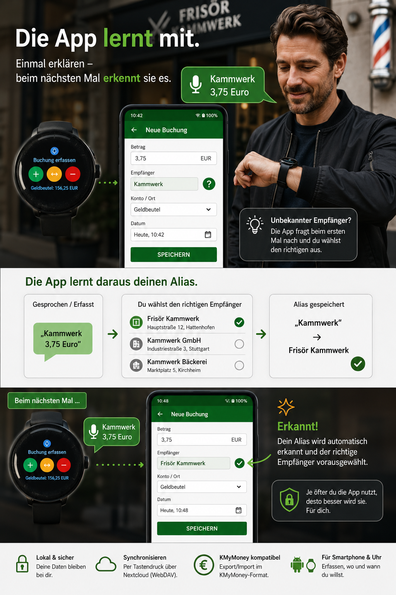
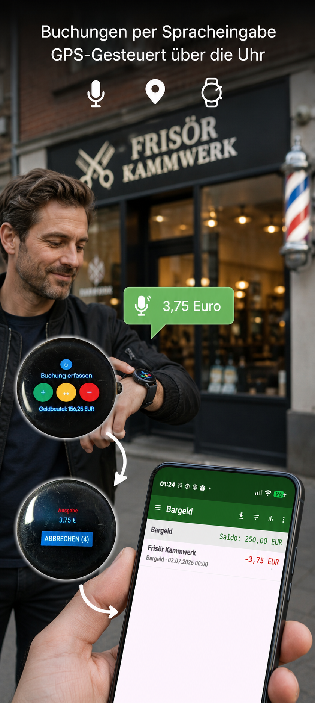
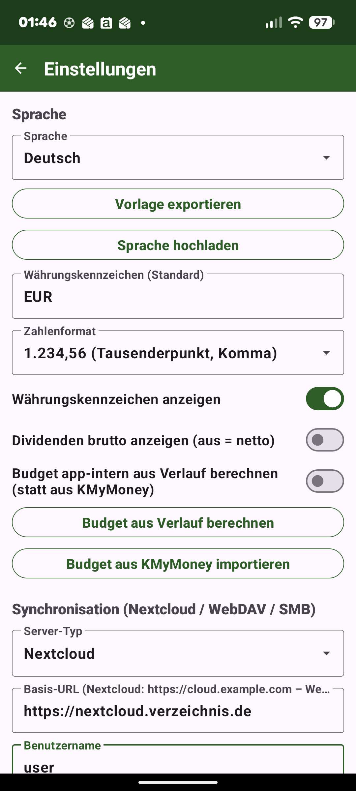

# Ausgaben

[English](README.md) · **Deutsch**

Eine mobile Ergänzung zu **[KMyMoney](https://kmymoney.org/)** (Android, Java). Erfasse Bargeld-Ausgaben,
-Einnahmen und Umbuchungen unterwegs direkt auf dem Smartphone oder einer Wear-OS-Uhr – und exportiere sie
nach KMyMoney, statt alles später von Hand nachzutragen.

> Offline-first · kein Konto, keine Werbung, kein Tracking · Open Source.

📖 Das vollständige **[Benutzerhandbuch (PDF, Deutsch)](docs/Handbuch-Ausgaben-de.pdf)** beschreibt jede
Funktion im Detail, mit Bildschirmfotos.

<p>
  
  
  
  
</p>

## Warum die App für KMyMoney-Nutzer interessant ist

- 📲 **Mobile Erweiterung für KMyMoney** – Bargeldausgaben unterwegs sofort erfassen
- 🔌 **Nahtlose KMyMoney-Integration** über `.kmy`-Dateien oder CSV-Import
- 🗂️ **Sync über einen gemeinsamen WebDAV- oder SMB-Ordner** – eigener Server, eigene Daten
- 🔒 **Vollständig offline nutzbar** – keine zusätzliche Cloud, kein Herstellerkonto
- ⌚ **Wear-OS-App mit Spracheingabe** – Ausgabe direkt vom Handgelenk sprechen
- ➗ **Splitbuchungen und Umbuchungen**, Kategorien, Orte/Bestände und Depot-Import
- 📈 **Auswertungen**: Verlauf je Konto, Kategorien-Kreisdiagramm, Budget (Ist/Soll), Depot-Rendite
- 🌍 **Mehrsprachig** – Deutsch und Englisch eingebaut, weitere Sprachen per Übersetzungs-Upload
- 👆 **Biometrische Sperre**, verschlüsselte Zugangsdaten, Backup & Wiederherstellung
- 🆓 **Keine Werbung. Open Source.**

## Screenshots

<p>
  
  
  
  
  
  
  
  
</p>

## Download

Die aktuellen APKs findest du auf der **[Releases-Seite](../../releases/latest)**:

- **app-full-release.apk** – die Handy-App mit Wear-OS-Anbindung (Android 8 / API 26 und neuer)
- **app-foss-release.apk** – dieselbe Handy-App ohne Google Play Services (F-Droid-Variante)
- **wear-release.apk** – die Wear-OS-Uhren-App (gesprochene Ausgaben an die Handy-App). Nur nötig,
  wenn die Uhr die App nicht automatisch mit der Handy-Installation erhält; sonst separat auf die Uhr
  sideloaden.

Beide sind mit demselben Schlüssel signiert (Voraussetzung für die Wear-Data-Layer-Kopplung). Zum
Installieren „Unbekannte Quellen zulassen".

### Build-Flavors / F-Droid

Die Handy-App baut in zwei Varianten:

- **`full`** – mit der Wear-OS-Anbindung über Google Play Services (`./gradlew :app:assembleFullRelease`).
- **`foss`** – dieselbe App **ohne jegliches Google Play Services**
  (`./gradlew :app:assembleFossRelease`), gedacht für **F-Droid**. Alle Funktionen bleiben, nur die
  Wear-OS-Brücke fehlt.

Die Wear-OS-App (`:wear`) benötigt den Google Wear Data Layer und bleibt daher **GitHub-only**. Hinweise
zur F-Droid-Paketierung in [`fdroid/`](fdroid/).

## Funktionen im Überblick

Details, Screenshots und die genaue Bedienung stehen im **[Benutzerhandbuch](docs/Handbuch-Ausgaben-de.pdf)**.

- **Buchungen erfassen**: Ausgabe/Umbuchung/Einnahme, Splitbuchungen, Belegfoto, Spracheingabe
  („Frisör 20 €“), stille Betrag-only-Erfassung per GPS-Standort, lernende Alias-Namen für
  Zahlungsempfänger.
- **Felder auswählen – überall gleich**: Empfänger, Konto, Kategorie und Ort sind Anzeige, Auswahlliste
  und Suchfeld in einem. Beim Hineingehen macht der bisherige Eintrag Platz (er steht blass als
  Platzhalter) und die ganze Liste klappt auf; beim Tippen wird laufend gesucht, auch nach Wortteilen
  mitten im Namen („kasse“ findet „Sparkasse“). Verlässt man das Feld ohne Auswahl, kommt der alte Wert
  zurück. Neue **Empfänger** dürfen dabei entstehen – Konten, Kategorien und Orte nicht, die müssen aus
  der Liste stammen. In den Kontenfeldern stehen zuerst die **Favoriten**, dann die Konten der gerade
  gewählten **Kontengruppe**, dann alle übrigen – jeder Block mit eigenem Symbol, jedes Konto nur einmal.
  Die Tastatur geht zu, sobald die Eingabe steht: nach einem Tipp auf einen Eintrag der Liste und auf die
  **Fertig-Taste**. Bleibt beim Tippen genau ein Treffer übrig, übernimmt die Fertig-Taste ihn – „visa u“
  genügt für „Visa Urlaub“.
- **Belegfotos nachbearbeiten**: direkt nach der Aufnahme (oder später über die Beleg-Zeile) lässt sich
  das Bild rechteckig zuschneiden, im Trapez-Modus eine schräg fotografierte Rechnung begradigen und
  Helligkeit/Kontrast anpassen. Das unbearbeitete Original bleibt dauerhaft als `…_original.jpg` erhalten;
  beim erneuten Bearbeiten fragt die App, ob die bisherige Bearbeitung fortgesetzt oder wieder beim Original
  begonnen wird. Wer nichts ändern will, übernimmt das Foto wie es ist.
- **Belege ansehen**: eigener Betrachter in der App – Wischen blättert durch die Seiten, Pinch und
  Doppeltipp vergrößern. Bewusst keine fremde Foto-App: die zeigt nach dem Bearbeiten aus ihrem Cache
  gern noch die alte Fassung.
- **Mehrseitige Belege**: eine Buchung nimmt beliebig viele Seiten auf (`<uuid>_p1.jpg`, `<uuid>_p2.jpg`, …
  mit gemeinsamer UUID), jede einzeln ansehbar, zuschneidbar und löschbar. In der KMyMoney-Notiz steht nur
  `BELEG: <uuid>` – die Seiten findet die App selbst. Hochgeladen wird nach `Belege/<Jahr>/` **neben der
  KMyMoney-Datei** (im CSV-Modus im Sync-Ordner); das Jahr folgt dem Buchungsdatum, und wird es über einen
  Jahreswechsel geändert, wandern die Bilder mit. Belege gelöschter Buchungen räumt die App beim nächsten
  Start selbst weg.
- **Liste & Filter**: Suche über Empfänger/Notiz/Kategorie, Betrags- und Zeitraumfilter, Rückgängig nach
  Löschen, eigene Rechentastatur im Betragsfeld.
- **Konten ordnen**: Die Schublade gliedert wie bisher nach Kontenart (Anlage, Verbindlichkeit, Depot);
  darüber liegen frei vergebene **Kontengruppen** wie „Favoriten" oder „Gemeinsam", denen ein Konto
  mehrfach angehören kann. Zwei Gruppen bringt die `.kmy` selbst mit: aus dem Institutsblock entstehen
  Bank-Gruppen, und die in KMyMoney als bevorzugt gekennzeichneten Konten bilden die Gruppe „Favoriten",
  die in der Auswahl ganz oben steht. Beide spiegeln nur die Datei und sind deshalb nicht änderbar; sie
  werden bei jedem Import neu gesetzt. Ein Tipp auf „Konten" klappt die Gruppen als Liste auf; die
  gewählte trägt ein Häkchen und gilt dann app-weit für Buchungsliste, Saldoleiste und Bestände. Die **Lupe** auf dem kMyMoney-Zeichen
  sucht Konten nach Namensteilen – die Eingabe tritt kurz an die Stelle der Überschrift und wird nirgends
  gespeichert. Über das Zahnrad lassen sich Konten und ganze
  Kontenarten **frei sortieren** (Reihenfolge gilt überall). Das ⋮ am Konto öffnet die Gruppen als
  Ankreuzliste: alle eigenen Gruppen auf einmal an- und abwählen, oben ein freies Feld für eine neue,
  übernommen wird mit „OK". Dieselbe Ankreuzliste schließt das Konto oder eröffnet es wieder. Eine
  eigene Gruppe verschwindet, sobald ihr das letzte Konto entzogen wird. Geschlossene Konten stehen nur dort, in grauer Schrift; bekommt ein geschlossenes
  Konto durch einen Import wieder einen Saldo, öffnet es sich von selbst.
- **Auswertungen**: Verlaufsdiagramm je Konto/Ort/gesamt, Kategorien-Kreisdiagramm („Wofür geht mein
  Geld?“), Budget (Ist/Soll aus KMyMoney oder app-intern berechnet), geplante Buchungen als Vorschau.
- **Geplante Buchungen**: aus KMyMoney importiert und in die einzelnen Termine aufgefaltet. Langer Druck auf
  den nächsten Termin öffnet ihn vorbefüllt im Editor – dort speichern oder **„Buchung überspringen"**. So
  oder so verschwindet der Termin aus der Liste und die KMyMoney-Regel wird beim nächsten `.kmy`-Export um
  eine Periode weitergestellt (die Regel selbst bleibt erhalten, spätere Termine unverändert).
- **Bestände & Depot**: mehrere Bargeld-**Orte** je Konto mit eigenem Bewegungsjournal und Kassensturz
  (Empfänger und Kategorie der Ausgleichsbuchung legt man einmal selbst fest, danach sind sie vorbelegt);
  Orte zeigen sich nur dort, wo welche angelegt sind — kein Ort, kein Ortsfeld, und ohne Orte überhaupt
  verschwindet der Knopf **„Umbuchen"**;
  Depot-Import mit vollständiger **Kurshistorie**, Käufen/Verkäufen/Dividenden, Gewinn/Verlust-Auswertung.
  Der Depotwert zählt wie ein Konto in **„Gesamt"** und in die Vermögensgrafik; im Verlauf zusätzlich als
  eigene Sichten **„Gesamt ohne Depot"** und **„Depot"**.
- **Synchronisierung**: Nextcloud/WebDAV/SMB, `.kmy`-Modus (direktes Schreiben/Lesen der KMyMoney-Datei
  inkl. Splits, Umbuchungen und Depot) oder CSV-Export; automatische Sicherung vor jedem Export, Schutz vor
  gleichzeitigem Überschreiben. Der `.kmy`-Modus kommt auch mit fremden Dateien zurecht: frisch angelegte
  Dateien ohne Buchungen, Konten in **Fremdwährung** (Beträge in der Kontowährung), Buchungen mit
  Schlagwörtern und mehrfach vergebene Kontonamen (dann mit ihrem Pfad, z. B. „Bank B:Girokonto").
- **Mehrsprachig**: Deutsch/Englisch eingebaut, weitere Sprachen per Übersetzungsdatei nachrüstbar (auch
  für die Uhr).
- **Darstellung**: dunkles Design und app-weite **Schriftgröße** (Klein/Normal/Groß/Sehr groß) – wirkt
  zusätzlich zur System-Schriftgröße; lange Kontonamen/Buchungstitel laufen bei Bedarf als Laufschrift.
- **Sicherung**: „Sicherung erstellen" schreibt **Daten und Einstellungen** (Konten, Orte, Kategoriefarben,
  Server-Zugang) in eine ZIP-Datei. Das Server-Passwort kommt nur auf Nachfrage mit; auf Wunsch wird die
  ganze Datei mit einem eigenen Sicherungspasswort verschlüsselt (AES-256-GCM, Endung `.abk`). Beim
  Einspielen fragt die App, was zurückkommen soll: nur Daten, nur Einstellungen oder beides.
- **Alles neu einlesen**: langer Druck auf „Alle Konten" – oder in dieser Ansicht nach unten ziehen – liest
  Konten, Depots und geplante Buchungen in einem Zug neu aus der `.kmy` (nur im kmy-Modus).
- **Sicherheit**: optionale biometrische App-Sperre, GPS standardmäßig aus, verschlüsselte Zugangsdaten.
  Startet die App selbst eine fremde App – Kamera, Galerie, Dateiauswahl, Spracheingabe –, fragt sie beim
  Zurückkommen innerhalb von fünf Minuten nicht erneut nach dem Fingerabdruck; man hat die App ja nie
  wirklich verlassen. Wer länger wegbleibt, muss sich wieder ausweisen.

## Wear OS (Sprach-Schnellerfassung)

Ein zusätzliches Modul `:wear` erfasst eine Bargeldausgabe per Sprache direkt auf einer Wear-OS-Uhr
(„Frisör 20 Euro“). Die Uhr nimmt nur den Text auf; Verarbeitung und Buchungsanlage passieren auf dem
Smartphone (derselbe Parser). Die Erkennung folgt der gewählten App-Sprache und **bevorzugt Offline**-
Spracherkennung, sodass die Aufnahme auch bei ausgeschaltetem Handy klappt; ist offline keine Sprache
verfügbar, fällt die Uhr auf den stillen Zahlenblock zurück. Offline aufgenommene Buchungen werden
zwischengespeichert (inkl. GPS) und automatisch nachgereicht, sobald das Handy erreichbar ist – ohne
Verlust und ohne Dopplung. Ein optionaler Handy-Schalter („Offline-Sprachpaket auf der Uhr installieren“,
nur `full`-Build) lädt das Offline-Sprachmodell der gewählten Sprache auf die Uhr. Details im Handbuch,
Kapitel „Wear OS“.

Voraussetzung: Phone- und Wear-App haben dieselbe `applicationId` **und** dieselbe Signatur.

## CSV-Format (Export)

Spaltentrenner (`;` oder `,`) und Dezimaltrennzeichen (Komma oder Punkt) folgen den Einstellungen, Datum
`TT.MM.JJJJ`, UTF-8, CRLF. Splitbuchungen werden je Kategorie als eigene Zeile geschrieben. Der Import ist
sprachunabhängig: Er liest KMyMoney-Ledger-Exporte in jeder Sprache (Deutsch, Englisch, …) und
re-importiert den App-eigenen Export.

```
Datum;Empfänger;Konto;Typ;Betrag;Notiz;Kategorie
29.06.2026;Metzgerei;Bargeld;Ausgabe;-7,30;Mittagessen;Lebensmittel
```

## Technik

- Java, Gradle 8.9 / AGP 8.7.3, `minSdk 26` (`:app`) bzw. `minSdk 30` (`:wear`), `compileSdk 34`.
- Module: `:app` (Phone) und `:wear` (Wear OS).
- [Room](https://developer.android.com/training/data-storage/room) (SQLite), OkHttp (WebDAV),
  [smbj](https://github.com/hierynomus/smbj) (SMB), [MPAndroidChart](https://github.com/PhilJay/MPAndroidChart),
  [osmdroid](https://github.com/osmdroid/osmdroid) (Karten-Auswahl),
  [androidx.security](https://developer.android.com/jetpack/androidx/releases/security)
  (verschlüsselte Prefs), [androidx.biometric](https://developer.android.com/jetpack/androidx/releases/biometric),
  [play-services-wearable](https://developer.android.com/training/wearables/data/data-layer) (Data Layer)
  und [androidx.wear.tiles](https://developer.android.com/training/wearables/tiles) (Tile).

## Bauen

```bash
./gradlew assembleDebug
```

Das Android-SDK wird über `local.properties` (`sdk.dir=…`) gefunden – diese Datei ist nicht
eingecheckt und muss lokal vorhanden sein (legt Android Studio automatisch an). Für einen signierten
Release-Build wird `keystore.properties` benötigt (ebenfalls nicht eingecheckt); fehlt sie, entsteht
ein unsigniertes Release.

## Sync-Ziel einrichten (Nextcloud / WebDAV / SMB)

In den Einstellungen den **Server-Typ** wählen, dann Basis-URL/Freigabe, Benutzername und Passwort
eintragen; ein Button **„Verbindung testen"** prüft die Zugangsdaten. Ohne konfiguriertes Sync-Ziel wird
lokal in einen selbst gewählten Ordner exportiert.

- **Nextcloud**: Basis-URL des Servers + ein **App-Passwort** (Nextcloud → Sicherheit → App-Passwort).
- **WebDAV (generisch)**: vollständige DAV-Wurzel-URL, Auth per HTTP-Basic.
- **SMB/Samba**: **Einrichtungsassistent** – die App sucht die SMB-Server im lokalen Netz (mDNS,
  NetBIOS und Port 445), danach anmelden, aus den gefundenen **Freigaben** wählen und den Zielordner
  durchklicken; gespeichert wird daraus `smb://Host/Freigabe/Ordner`. Leerer Benutzer = Gast, Domäne als
  `DOMÄNE\Benutzer`, SMB2/3. Lauscht der Server nicht auf dem Standardport 445, trägt man den Port im
  Assistenten ein bzw. schreibt ihn in die Adresse (`smb://Host:7777/Freigabe`). Antwortet dort
  niemand, versucht die App zusätzlich den **Standardport 445** und korrigiert die gespeicherte
  Adresse – ein aus der Server-Auskunft (mDNS) übernommener Port führt so nicht mehr in die Irre.
  Über „Server manuell eingeben" bleibt die Adresseingabe von Hand möglich.
  **Passwortlose Freigaben**: Passwortfeld leer lassen – die App arbeitet dann als Gast weiter, auch
  wenn ein Benutzername eingetragen ist. Nur wer ein Passwort eingibt und trotzdem als Gast
  eingestuft wird, bekommt weiterhin eine Fehlermeldung (Schutz vor stiller Gast-Herabstufung).
  Unterstützt werden auch Freigaben mit **SMB3-Verschlüsselung** (`smb encrypt = required`), **DFS**
  und rein **anonyme** Freigaben; verlangt der Server Signierung, wird signiert.
- **Diagnose**: Der Knopf „Verbindung prüfen (Diagnose)" – in den Einstellungen **und** im
  Erststart-Assistenten – geht die ganze Kette durch (Verbinden → Aushandeln → Anmelden → Freigaben →
  Freigabe → Ordner lesen → **Schreibrecht** → Datei) und zeigt je Schritt Ergebnis, Dauer und – im
  Fehlerfall – den rohen Statuscode. Geprüft wird auch, ob der Zielordner **beschreibbar** ist: ein
  nur lesbares Verzeichnis fällt sonst erst beim Rückschreiben auf. Der Bericht lässt sich kopieren
  und enthält weder Passwort noch Benutzernamen.

## Lizenz

Veröffentlicht unter der **GNU General Public License v3.0** – siehe [LICENSE](LICENSE).

## Haftungsausschluss / Hinweis zum Entwicklungsprozess

Dieses Projekt wurde ursprünglich mit umfangreicher Unterstützung durch KI entwickelt.

Ich arbeite seit etwa 25 Jahren als Softwareentwickler, allerdings überwiegend in Technologien außerhalb des modernen Mobile-App-Umfelds. Obwohl ich Erfahrung mit Java habe und Teile des Quellcodes geprüft habe, kann ich nicht behaupten, jedes während der Entwicklung erzeugte Implementierungsdetail vollständig zu verstehen.

Die Anwendung wurde getestet und wird aktiv genutzt. Dennoch können Fehler, architektonische Schwächen oder Codebereiche vorhanden sein, die von Entwicklern mit mehr Android-spezifischer Erfahrung verbessert werden könnten.

Ich überprüfe den erzeugten Code kontinuierlich, erweitere mein Verständnis der Implementierung und entwickle das Projekt fortlaufend weiter. Code-Reviews, Fehlermeldungen, Verbesserungsvorschläge und Beiträge aus der Community sind daher ausdrücklich willkommen.
