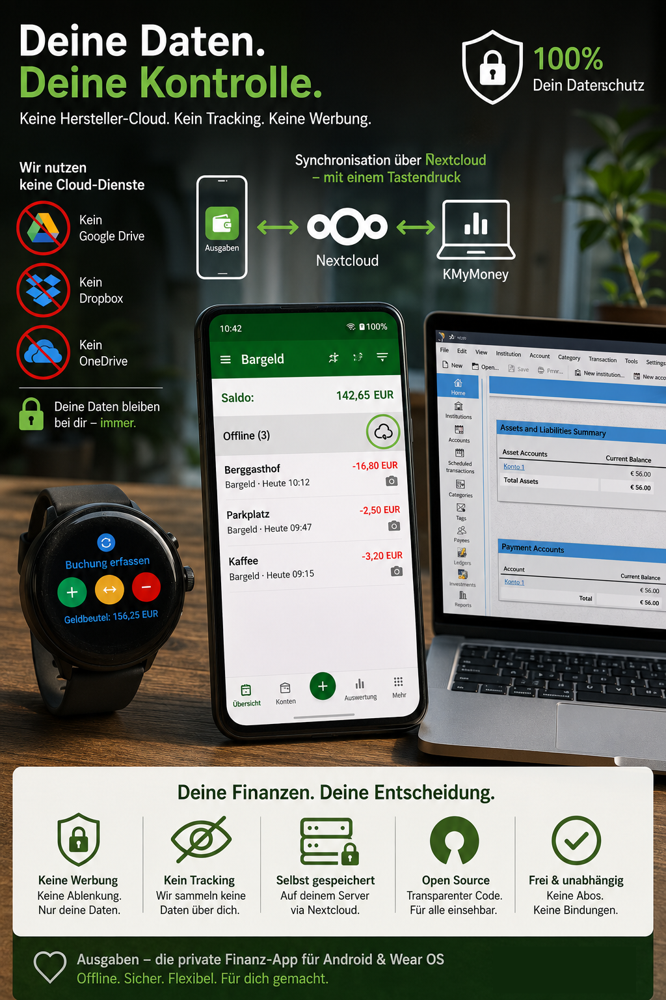
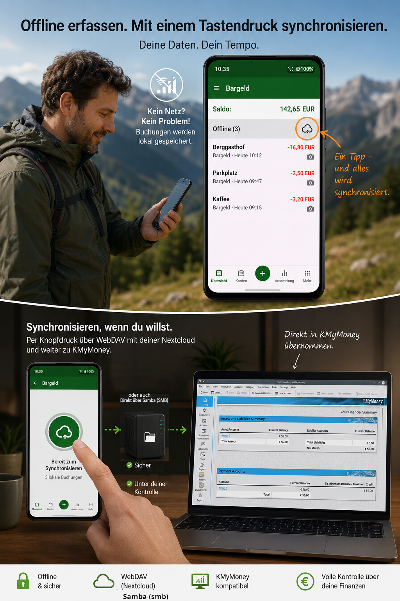
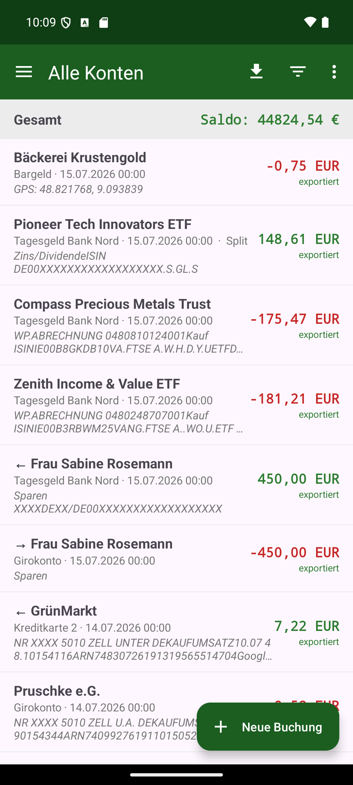
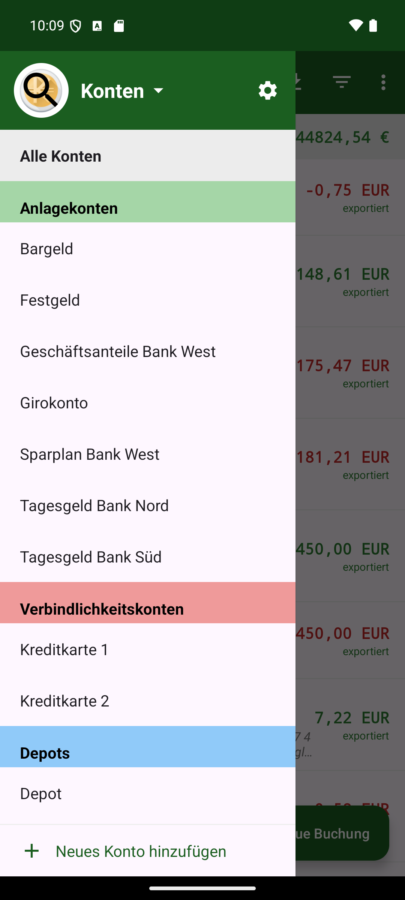
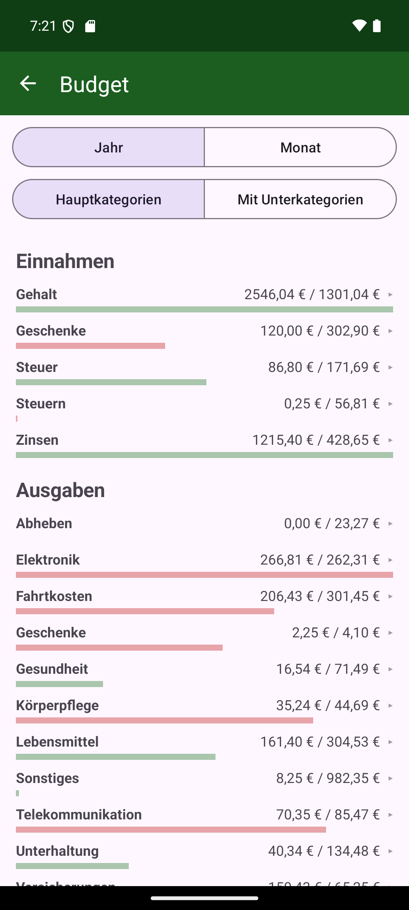

# Ausgaben

**English** · [Deutsch](README.de.md)

A mobile companion app for **[KMyMoney](https://kmymoney.org/)** (Android, Java). Record cash expenses,
income and transfers on the go — right on your phone or a Wear OS watch — and export them into KMyMoney,
instead of typing everything in by hand later.

> Offline-first · no account, no ads, no tracking · open source.

*("Ausgaben" is German for "expenses".)*

📖 The full **[user manual (PDF, English)](docs/Manual-Ausgaben-en.pdf)** describes every feature in
detail, with screenshots.

<p>
  
  
  
  
</p>
<sub>(Promo graphics are in German; the app itself is fully available in English.)</sub>

## Why it might be useful for KMyMoney users

- 📲 **Mobile extension for KMyMoney** — capture cash spending the moment it happens
- 🔌 **Seamless KMyMoney integration** via `.kmy` files or CSV import
- 🗂️ **Sync through a shared WebDAV or SMB folder** — your own server, your data
- 🔒 **Fully offline** — no extra cloud, no vendor account required
- ⌚ **Wear OS app with voice input** — speak an expense right from your wrist
- ➗ **Split bookings and transfers**, categories, places/holdings and portfolio import
- 📈 **Analysis**: history per account, category pie chart, budget (actual/planned), portfolio return
- 🌍 **Multilingual** — ships in English and German, more languages via translation upload
- 👆 **Biometric lock**, encrypted credentials, backup & restore
- 🆓 **No ads. Open source.**

## Screenshots

<p>
  
  
  
  
  
  
  
  
</p>

## Download

The current APKs are on the **[releases page](../../releases/latest)**:

- **app-full-release.apk** — the phone app with the Wear OS bridge (Android 8 / API 26 and up)
- **app-foss-release.apk** — the same phone app without Google Play Services (F-Droid build)
- **wear-release.apk** — the Wear OS watch app (spoken expenses to the phone app). Only needed if
  the watch doesn't get the app automatically alongside the phone install; otherwise sideload it onto the
  watch separately.

Both are signed with the same key (required for Wear Data Layer pairing). Enable "Install from unknown
sources" to install.

### Build flavors / F-Droid

The phone app builds in two flavors:

- **`full`** — with the Wear OS bridge via Google Play Services (`./gradlew :app:assembleFullRelease`).
- **`foss`** — the same app **without any Google Play Services**
  (`./gradlew :app:assembleFossRelease`), meant for **F-Droid**. Every feature stays; only the Wear OS
  bridge is missing.

The Wear OS app (`:wear`) needs the Google Wear Data Layer and stays **GitHub-only**. See [`fdroid/`](fdroid/)
for F-Droid packaging notes.

## Features at a glance

Details, screenshots and exact behavior are in the **[user manual](docs/Manual-Ausgaben-en.pdf)**.

- **Record bookings**: expense/transfer/income, split bookings, receipt photos, voice input
  ("hairdresser 20 €"), silent amount-only entry resolved via GPS location, learning payee aliases.
  The **six nearest payees** head the suggestion list with a bearing arrow – measured from the
  booking's location: the current one while creating, the booking's stored mark while editing. As soon
  as you type, the plain alphabetical list is back. Once the payee is set, the **first category** is
  filled from its previous entries (preferred alias → latest booking → other alias); the remaining
  ones head the category list as their own block.
- **Edit receipt photos**: right after the shot (or later from the receipt row) you can crop the image to a
  rectangle, straighten a skewed bill in trapezoid mode and adjust brightness/contrast. The untouched
  original is kept as `…_original.jpg` for good; editing again asks whether to continue from the current
  version or start over from that original. If you don't want to change anything, keep the photo as it is.
- **View receipts**: a viewer built into the app — swipe to page through a multi-page receipt, pinch and
  double-tap to zoom. Deliberately not an external photo app: those tend to serve the pre-edit version
  from their cache.
- **Multi-page receipts**: a booking takes as many pages as you like (`<uuid>_p1.jpg`, `<uuid>_p2.jpg`, …
  sharing one UUID), each one viewable, croppable and removable on its own. The KMyMoney note only holds
  `BELEG: <uuid>` — the app finds the pages by itself. They are uploaded to `Belege/<year>/` **next to the
  KMyMoney file** (in CSV mode into the sync folder); the year follows the booking date, and moving that
  date across new year takes the images along. Receipts of deleted bookings are cleaned up on the next
  app start.
- **List & filter**: search across payee/note/category, amount, date-range and **radius** filters (100 m
  to 10 km around your own position, only with location enabled), undo after delete, a built-in
  calculator keyboard in the amount field.
- **Organising accounts**: the drawer still groups by account kind (asset, liability, portfolio); on top
  of that come freely chosen **account groups** such as "Favourites" or "Joint", and an account may belong
  to several of them. Two groups come out of the `.kmy` itself: the institutions block yields bank groups,
  and the accounts marked as preferred in KMyMoney form the "Favourites" group, which sits at the top of
  the picker. Both merely mirror the file and therefore cannot be edited; they are rebuilt on every
  import. Tapping "Accounts" drops the groups down as a list; the chosen one carries a tick and then
  applies app-wide to the booking list, the balance bar and the holdings view. The **magnifier** on the kMyMoney
  emblem searches accounts by part of their name — the input briefly takes the place of the heading and is
  never stored. The gear icon opens a view where accounts and whole
  account kinds can be **reordered freely** (the order applies everywhere). The ⋮ next to an account
  opens its groups as a tick list: check and uncheck all your own groups at once, with a free field on
  top for a new one, applied with "OK". The same list also closes or reopens the account. A group of
  your own disappears as soon as its last account is taken out of it. Closed accounts appear only there, in grey; if a closed account regains a balance on
  import, it reopens by itself.
- **Analysis**: history chart per account/place/total, category pie chart ("Where does my money go?"),
  budget (actual vs. planned, imported from KMyMoney or computed in-app), scheduled bookings preview.
  With an **account group** selected, the history offers it as its own view behind "Total" and "Total
  without portfolio" — including the group's portfolios, so the figure matches the balance bar.
- **Scheduled bookings**: imported from KMyMoney and unfolded into their individual dates. Long-press the
  next date to open it prefilled in the editor — save it as a real booking, or use **"Skip booking"** there.
  Either way that date disappears from the list and the KMyMoney schedule is moved on by one period on the
  next `.kmy` export (the schedule itself is kept, later dates stay untouched).
- **Holdings & portfolio**: several cash **places** per account with their own movement journal and
  reconciliation (you set the payee and category of the balancing booking once, they are prefilled from
  then on); places only ever show up where you have created some — no place, no place field, and without
  any places at all the "Transfer" button is gone; portfolio import with the full **price history**,
  buys/sells/dividends, gain/loss
  analysis. The portfolio value counts like an account in **"Total"** and in the net-worth graph; the
  history additionally offers the views **"Total without portfolio"** and **"Portfolio"**.
- **Sync**: Nextcloud/WebDAV/SMB, `.kmy` mode (writes/reads the KMyMoney file directly, including splits,
  transfers and the portfolio) or CSV export; automatic backup before every export, protection against
  concurrent overwrites. The `.kmy` mode also copes with other people's files: freshly created files without
  bookings, accounts in a **foreign currency** (amounts in the account's currency), tagged transactions and
  account names used more than once (shown with their path, e.g. "Bank B:Checking").
  Change a booking that was already transferred and it becomes **"edited"**: its transaction is changed in
  the file on the next transfer (same transaction, no duplicate); re-importing the `.kmy` file in the
  meantime overwrites the edit.
- **Multilingual**: English/German built in, more languages via a translation file (also on the watch).
- **Appearance**: dark theme and an app-wide **font size** (Small/Normal/Large/Very large) — applied on
  top of the system font size; long account names/booking titles marquee-scroll when they no longer fit.
- **Backup**: "Create backup" writes **data and settings** (accounts, places, category colours, server
  access) into a ZIP file. The server password is only included if you ask for it, and the whole file can be
  encrypted with a backup password of your own (AES-256-GCM, extension `.abk`). When restoring, the app asks
  what should come back: data only, settings only or both.
- **Reload everything**: a long press on "All accounts" — or pulling down in that view — reloads accounts,
  portfolios and scheduled transactions from the `.kmy` in one go (kmy mode only).
- **Security**: optional biometric app lock, GPS off by default, encrypted credentials. When the app hands
  over to another app itself — camera, gallery, file picker, speech input — returning within five minutes
  does not ask for your fingerprint again; from your point of view you never left. Stay away longer and the
  lock is back.

## Wear OS (voice quick capture)

An additional `:wear` module records a cash expense by voice right on a Wear OS watch ("hairdresser 20
euros"). The watch only captures the text; processing and creating the booking happen on the phone (the
same parser). Recognition follows the selected app language and **prefers offline** speech, so recording
works even with the phone off; if offline speech isn't available the watch falls back to the silent number
pad. Bookings recorded offline are buffered (incl. GPS) and sent automatically once the phone is reachable
— without loss or duplication. An opt-in phone setting ("Install offline speech package on the watch",
`full` build only) lets the watch download the offline speech model for the chosen language. See the
"Wear OS" chapter in the manual for details.

Requirement: the phone and watch app share the same `applicationId` **and** the same signature.

## CSV format (export)

Column separator (`;` or `,`) and decimal separator (comma or dot) follow the settings, date
`DD.MM.YYYY`, UTF-8, CRLF. Split bookings are written as one row per category. Import is
language-independent: it reads KMyMoney ledger exports in any language (German, English, …) and re-imports
the app's own export.

```
Datum;Empfänger;Konto;Typ;Betrag;Notiz;Kategorie
29.06.2026;Metzgerei;Bargeld;Ausgabe;-7,30;Mittagessen;Lebensmittel
```

## Tech

- Java, Gradle 8.9 / AGP 8.7.3, `minSdk 26` (`:app`) / `minSdk 30` (`:wear`), `compileSdk 34`.
- Modules: `:app` (phone) and `:wear` (Wear OS).
- [Room](https://developer.android.com/training/data-storage/room) (SQLite), OkHttp (WebDAV),
  [smbj](https://github.com/hierynomus/smbj) (SMB), [MPAndroidChart](https://github.com/PhilJay/MPAndroidChart),
  [osmdroid](https://github.com/osmdroid/osmdroid) (map picker),
  [androidx.security](https://developer.android.com/jetpack/androidx/releases/security)
  (encrypted prefs), [androidx.biometric](https://developer.android.com/jetpack/androidx/releases/biometric),
  [play-services-wearable](https://developer.android.com/training/wearables/data/data-layer) (Data Layer)
  and [androidx.wear.tiles](https://developer.android.com/training/wearables/tiles) (tile).

## Building

```bash
./gradlew assembleDebug
```

The Android SDK is located via `local.properties` (`sdk.dir=…`) — this file is not checked in and must be
present locally (Android Studio creates it automatically). A signed release build needs
`keystore.properties` (also not checked in); without it an unsigned release is produced.

## Setting up a sync target (Nextcloud / WebDAV / SMB)

In the settings choose the **server type**, then enter base URL/share, username and password; a **"Test
connection"** button checks the credentials. Without a configured sync target, export goes locally into a
folder you choose.

- **Nextcloud**: base URL of the server + an **app password** (Nextcloud → Settings → Security → App
  password).
- **WebDAV (generic)**: the full DAV root URL, auth via HTTP basic.
- **SMB/Samba**: **setup wizard** — the app scans the local network for SMB servers (mDNS, NetBIOS and
  port 445), then you log in, pick one of the **shares** it lists and browse to the target folder; that
  becomes `smb://host/share/folder`. Empty user = guest, a Windows domain as `DOMAIN\user`, SMB2/3.
  If the server does not listen on the default port 445, enter the port in the wizard or put it into the
  address (`smb://host:7777/share`). If nothing answers there, the app also tries the **default port
  445** and corrects the stored address — a port picked up from the server's own mDNS announcement can
  no longer lead you astray. "Enter server manually" still allows typing the address yourself.
  **Shares without a password**: leave the password field empty and the app continues as guest, even
  with a user name filled in. Only if you do enter a password and are still downgraded to guest do you
  get an error (the guard against silent guest downgrades).
  Shares with **SMB3 encryption** (`smb encrypt = required`), **DFS** and purely **anonymous** shares
  work as well; if the server requires signing, traffic is signed.
- **Diagnostics**: the button "Check connection (diagnostics)" — in the settings **and** in the
  first-start wizard — walks the whole chain (connect → negotiate → log in → shares → share → read
  folder → **write permission** → file) and shows, per step, the result, the duration and — on
  failure — the raw status code. It also checks that the target folder is **writable**: a read-only
  directory would otherwise only surface when writing back. The report can be copied and contains
  neither the password nor the user name.

## License

Released under the **GNU General Public License v3.0** — see [LICENSE](LICENSE).

## Disclaimer

This project was initially developed with extensive AI assistance.

I have been working as a software developer for approximately 25 years, but primarily in technologies outside the modern mobile application ecosystem. While I have experience with Java and have reviewed parts of the codebase, I cannot claim to fully understand every implementation detail generated during the development process.

The application has been tested and is actively used, but there may still be bugs, architectural shortcomings, or code that could be improved by developers with more Android-specific experience.

I am continuously reviewing, learning from, and refining the generated code. Contributions, code reviews, bug reports, and suggestions are therefore especially welcome.
